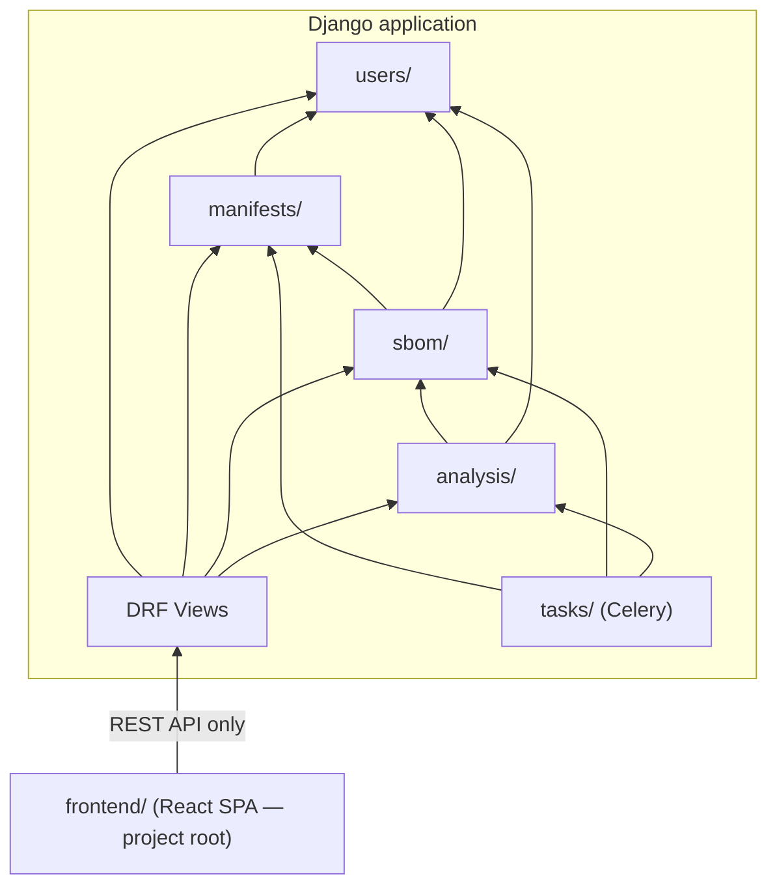
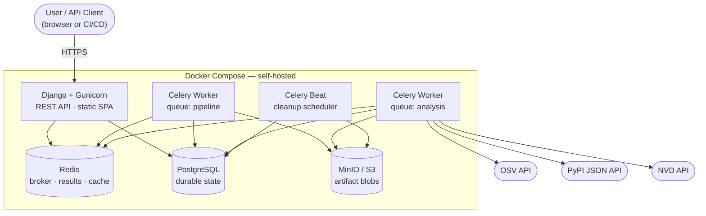
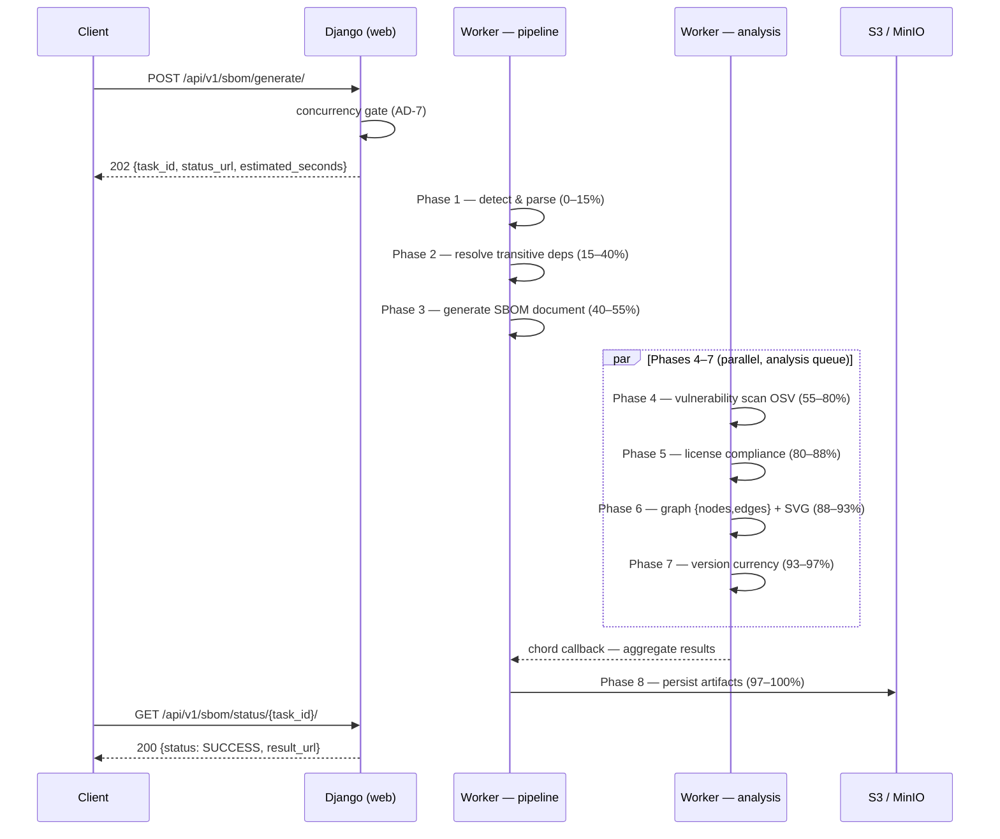
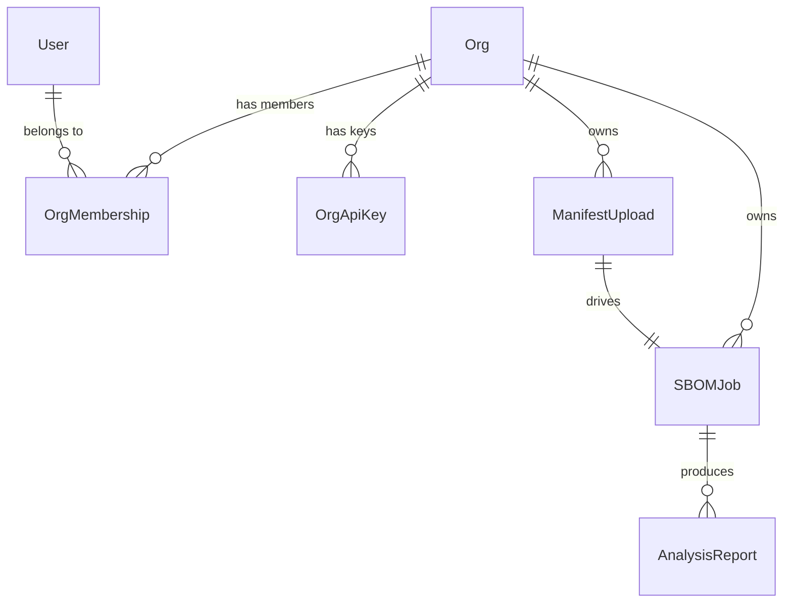

# Architecture Spine — django-python-generate-sbom

## Design Paradigm

**Layered Modular Monolith with Async Pipeline.**

The system is a single deployable Django application. Module boundaries are Django apps; cross-module calls go through Python service functions, never HTTP. A Celery pipeline runs the same service layer functions asynchronously — no duplicate logic between the HTTP and async paths.

Four layers, strict top-to-bottom dependency:

```
HTTP / React SPA   →   DRF Views   →   Service Layer   →   ORM / External APIs
                                ↑
                        Celery Tasks (same service layer, no HTTP)
```

A React SPA (served as static assets) is the UI layer. It communicates exclusively through the versioned REST API. No server-side rendering of business data.

---

## Invariants & Rules

### AD-1 — Modular monolith: no inter-app HTTP [ADOPTED]

- **Binds:** all Django apps
- **Prevents:** HTTP-to-HTTP calls between Django apps; premature microservice extraction
- **Rule:** All cross-app calls are direct Python imports from the target app's `services.py` or `selectors.py`. No `requests` calls to localhost. No shared task queues used as a coupling mechanism.

### AD-2 — OrgScopedModel: explicit org isolation

- **Binds:** all models owning org data; all service functions; all DRF views
- **Prevents:** cross-org data access; existence leaks on unauthorized access
- **Rule:** Every model owning org data extends `OrgScopedModel` (abstract base with `org` FK + `OrgScopedQuerySet` providing `.for_org(org)`). All queries use `.for_org(org)`. DRF views extract org from the authenticated API key (`request.auth.org`) and pass it as the first positional argument to every service function. **API endpoints** return `404` (never `403`) for cross-org or non-existent object access — `Model.objects.for_org(org).get(pk=pk)` raises `DoesNotExist` for both cases, hiding existence from API consumers. **Web UI routes** (served by the React SPA) return `403` for authenticated users accessing another org's resources — UUID-based URLs do not leak existence, and `403` gives clearer UX for the shared-link use case (FR-6.8).

### AD-3 — Service layer purity

- **Binds:** `services.py` and `selectors.py` in all apps
- **Prevents:** HTTP or Celery coupling leaking into business logic; untestable services
- **Rule:** Service functions accept and return plain Python objects only — no `HttpRequest`, no `Response`, no Celery `Task` instance. The same service function must be callable from a DRF view and a Celery task without modification.

### AD-4 — Two Celery queues: `pipeline` and `analysis`

- **Binds:** `tasks/sbom_pipeline.py`, `tasks/analysis.py`, Docker Compose worker definitions
- **Prevents:** long vulnerability scans starving new job submissions from other orgs
- **Rule:** Phases 1–3 (detect, resolve, generate) and Phase 8 (persist) route to the `pipeline` queue. Phases 4–7 (vulnerability, license, graph, version) route to the `analysis` queue. Celery Beat cleanup tasks (FR-8.2) also route to the `pipeline` queue — low-frequency housekeeping that does not compete with analysis work. Two separate Celery worker processes, one per queue. A task must never be enqueued to the wrong queue.

### AD-5 — React SPA: REST API only, no Django template coupling

- **Binds:** `frontend/` (project root), all DRF endpoints, `backend/config/settings/base.py`
- **Prevents:** Django template context injection into React; server-side rendered business data; API bypass
- **Rule:** The React SPA lives in `frontend/` at the project root (peer to `backend/`) and is built to `frontend/dist/`. Django's `STATICFILES_DIRS` includes `../frontend/dist/` (relative to `backend/`); WhiteNoise serves the built SPA from there. In Docker Compose, a shared volume or multi-stage Dockerfile makes `frontend/dist/` available to the Django container before `collectstatic` runs. All data flows through the versioned REST API (`/api/v1/`). No Django template tag, context processor, or `` passes business data to React components.

### AD-6 — Storage triad: no artifact blobs in PostgreSQL or Redis [ADOPTED]

- **Binds:** all persistence paths
- **Prevents:** Redis memory exhaustion from artifact blobs; PostgreSQL bloat; stale Redis keys becoming the system of record
- **Rule:** PostgreSQL holds durable models (jobs, keys, reports, org state). Redis holds transient Celery broker messages, task result metadata (keys, not blobs), and TTL-cached external API responses. S3/MinIO holds all binary artifact blobs. Artifact keys (storage paths) are stored in PostgreSQL `SBOMJob.result_key` and `AnalysisReport.artifact_key`; blobs are never written to PostgreSQL or Redis.

### AD-7 — Per-org concurrency gate at enqueue

- **Binds:** `POST /api/v1/sbom/generate/`, `manifests/views.py` — this view owns the generate endpoint and creates both the `ManifestUpload` and `SBOMJob` records before dispatching the pipeline task
- **Prevents:** one org exhausting all Celery worker slots
- **Rule:** Before enqueuing, execute `SBOMJob.objects.for_org(org).filter(status__in=['PENDING', 'PROGRESS']).count()`. If the result meets or exceeds `settings.SBOM_MAX_CONCURRENT_JOBS_PER_ORG` (default `5`, set via env var), return `429` with a `Retry-After` header. The count check is not atomic; the occasional over-admission (one extra job) is acceptable at target scale.

### AD-8 — API key via `AbstractAPIKey` subclass [ADOPTED]

- **Binds:** `users/models.py`, DRF authentication class
- **Prevents:** custom crypto code in the auth path; PBKDF2 being used for random-token keys (wrong tool)
- **Rule:** `OrgApiKey` extends `AbstractAPIKey` from `djangorestframework-api-key`, adding `org` FK, `last_used_at`, and `revoked_at`. Library handles key generation, SHA-512 hashing, prefix storage, and the DRF auth class. A custom auth class subclass updates `last_used_at` on each authenticated request and validates that the key's org matches the resource's org.

### AD-9 — Graph API shape: `{nodes, edges}` JSON, no PyVis HTML

- **Binds:** `analysis/services/graph.py`, `GET /api/v1/sbom/result/{task_id}/reports/graph/`
- **Prevents:** PyVis HTML in the API response; iframe in the React UI
- **Rule:** Phase 6 produces two outputs: structured graph JSON for the interactive React view, and a Graphviz SVG for the static download artifact. The graph API endpoint (`GET /api/v1/sbom/result/{task_id}/reports/graph/`) returns JSON with this exact shape (required by Cytoscape.js `data` wrapper convention):

```json
{
  "nodes": [{"data": {"id": "<name>==<version>", "label": "<name>", "version": "<version>"}}],
  "edges": [{"data": {"source": "<node_id>", "target": "<node_id>"}}]
}
```

The SVG is stored in S3 and returned as a separate download via AD-11. No PyVis HTML is generated or served.

### AD-11 — Artifact downloads via presigned URL; never proxied through Django

- **Binds:** `GET /api/v1/sbom/result/{task_id}/`, all analysis report download endpoints
- **Prevents:** artifact blobs flowing through Django process memory; incompatible download strategies between builders
- **Rule:** Artifact downloads return `303 See Other` to a presigned S3/MinIO URL (24-hour TTL). The view fetches `artifact_key` from PostgreSQL via `SBOMJob.objects.for_org(org)`, generates the presigned URL via `django-storages`, and redirects. Django never reads or streams artifact bytes. MinIO in local dev supports the same presigned URL pattern — no special-casing required.

### AD-12 — `SBOMJob.status` written exclusively by Celery task code

- **Binds:** `sbom/services.py`, `tasks/sbom_pipeline.py`, `manifests/views.py`
- **Prevents:** race conditions between view-level and task-level status writes; two owners of the same state field
- **Rule:** `SBOMJob.status` is mutated only by Celery task code, via a dedicated service function in `sbom/services.py`. DRF views read status but never write it. The sole exception: `manifests/views.py` sets the initial `status='PENDING'` at job creation, before `delay_on_commit()` is called.

### AD-10 — `delay_on_commit()` for all task dispatch from views [ADOPTED]

- **Binds:** every Celery task dispatch inside a Django view or signal handler
- **Prevents:** worker reading stale database state before the dispatching transaction commits
- **Rule:** Always use `task.delay_on_commit()` (never `.delay()` or `.apply_async()` without `using=connection`) when dispatching a Celery task from within a database transaction. Use `@shared_task` on all task definitions — no direct Celery app imports in task modules.

### AD-13 — Monorepo layout: `backend/` and `frontend/` are project-root peers under a pixi umbrella

- **Binds:** project scaffold, Docker Compose service definitions, CI matrix, all path references in tooling
- **Prevents:** Django scaffold generated at the project root; Node left unmanaged / provisioned by a separate out-of-band installer; frontend and backend toolchains sharing a working directory or a dependency manifest
- **Rule:** The project root contains exactly two application directories: `backend/` (Django + Celery Python code) and `frontend/` (React + Vite). **Pixi is the umbrella toolchain for the whole project.** A single `pixi.toml` at the **project root** owns the environment: it installs the Python runtime and dependencies **and** the Node runtime (`nodejs` from conda-forge, pinned in `pixi.lock`). All top-level tasks are `pixi run <task>` commands executed from the project root; backend tasks set `cwd = "backend"`, frontend tasks set `cwd = "frontend"` and shell out to `npm`/`vite`. `manage.py`, `pyproject.toml` (Python tool config + package metadata), and the Django code live under `backend/`. `package.json` and `vite.config.ts` live under `frontend/`; npm manages JavaScript **dependencies**, but pixi provides the Node runtime that runs it and orchestrates the frontend build/lint tasks. `docker-compose.yml`, `README.md`, `LICENSE`, `pixi.toml`, and `pixi.lock` live at the project root. Docker Compose `build.context` for the Django service is `./backend`; for the frontend build stage it is `./frontend`. The unified `pixi run ci` gate runs both backend (build, check, lint, cov) and, once the frontend exists (Story 1.4), frontend (lint, build) steps.

---

## Dependency Direction

Who may import whom. Arrows point from dependent to dependency. Any import that reverses an arrow is forbidden.



`users/` is the base layer — it never imports from `manifests/`, `sbom/`, `analysis/`, or `tasks/`.

---

## Consistency Conventions

| Concern | Convention |
|---|---|
| Module naming | Django apps: `snake_case`; service functions: `verb_noun(org, ...)`; selectors: `get_noun_by_x(org, ...)`; tasks: `verb_noun_task` |
| File roles | `views.py` — DRF viewsets only; `services.py` — mutation logic; `selectors.py` — read-only queries; `models.py` — ORM only, no business logic |
| API shape | All endpoints under `/api/v1/`; error envelope `{"error": "<message>", "code": "<snake_case_code>"}` ; dates ISO 8601 UTC; `task_id` is UUID v4 |
| Auth header | `Authorization: Api-Key <key>` on all API requests; unauthenticated requests return `401` |
| Org access in views | `request.auth` is the `OrgApiKey` instance; `org = request.auth.org` — always accessed this way, never from session or query param |
| Org in services | Org is always the first positional parameter of any service or selector function that touches org-owned data: `def generate_sbom(org: Org, manifest_id: UUID, ...)` |
| Storage paths — manifests | `manifest-uploads/{org_id}/{upload_id}/{filename}` |
| Storage paths — artifacts | `sbom-results/{org_id}/{task_id}/{filename}.{ext}` |
| Analysis chord envelope | Each analysis task returns `{"report_type": "vuln|license|graph|version", "artifact_key": "<s3_key>|null", "summary": {...}, "failed": bool, "failure_reason": "<str>|null"}`; chord callback sets `AnalysisReport.failed` and `artifact_key` from these fields |
| Artifact cleanup | `artifacts_expire_at` set at job creation (`completed_at + 10 days`); cleanup selector: `SBOMJob.objects.filter(artifacts_expire_at__lte=now(), result_key__isnull=False)`; after S3 deletion null `result_key` on `SBOMJob` and `artifact_key` on all related `AnalysisReport` rows; job record is never deleted |
| Pagination | `PageNumberPagination`; default `page_size=25`, max 100 via `?page_size=`; envelope: `{"count": N, "next": "<url>\|null", "previous": "<url>\|null", "results": [...]}` |
| Health check | `GET /health/` returns `{"status": "ok"}` with `200`; unauthenticated; used for Docker Compose `healthcheck:` directive |
| Logging | `structlog` with JSON renderer; every log entry binds `org_id`, `task_id` (where applicable), `user_id`; never `print()` or stdlib `logging` |
| Configuration | All config via environment variables through `django-environ`; `.env` file for local dev; never committed secrets |
| Error handling | Never bare `except:`; always catch specific exceptions; log at `error` level before re-raising or returning a domain error; `except SomeError: pass` is forbidden |
| Task state updates | `task.update_state(state='PROGRESS', meta={'progress': N, 'current_step': '<phase name>'})` at the start of each pipeline phase |
| Frontend data | All API calls from `frontend/src/api/`; no direct `fetch` calls in components; polling via a shared `useJobStatus(taskId)` hook |

---

## Stack

| Name | Version |
|---|---|
| Python | 3.14.6 |
| Django | 6.0.6 |
| djangorestframework | 3.17.1 |
| djangorestframework-api-key | 3.1.0 |
| django-storages | 1.14.6 |
| django-environ | 0.14.0 |
| Celery | 5.6.3 |
| structlog | 26.1.0 |
| cyclonedx-python-lib | 11.11.0 |
| lib4sbom | 0.10.4 |
| pip-licenses | 5.5.5 |
| NetworkX | 3.6.1 |
| pygraphviz | 2.0 |
| requests-cache | 1.3.2 |
| requests-ratelimiter | 0.10.0 |
| packaging | 26.2 |
| tenacity | 9.1.4 |
| WhiteNoise | 6.12.0 |
| PostgreSQL | 18.4 |
| Redis | 8.8.0 |
| React | 19.2.7 |
| @mui/material | 9.1.2 |
| Vite | 8.1.3 |
| cytoscape | 3.34.0 |
| react-cytoscapejs | 2.0.0 |
| cytoscape-dagre | 4.0.0 |
| pixi | 0.71.0 |

---

## Structural Seed

### System containers



### Async pipeline flow



### Core entity relationships



### Source tree

```text
django-python-generate-sbom/          ← project root (pixi umbrella environment)
  pixi.toml                           # umbrella: Python env + Node runtime + all tasks
  pixi.lock                           # pins Python AND Node deps
  backend/                            ← Django + Celery Python code
    config/
      settings/                       # base.py · local.py · production.py
      celery_app.py
      urls.py
    <project_slug>/
      users/                          # Org · User · OrgMembership · OrgApiKey
      manifests/                      # ManifestUpload · upload · format detection (F3)
      sbom/                           # SBOMJob · generation · parsers/ (F4)
        parsers/                      # requirements.py · pyproject.py · pixi_lock.py
                                      # pixi_toml.py · conda.py
      analysis/                       # AnalysisReport · 4 analysis services (F5)
        services/                     # vulnerability.py · license.py · graph.py · versions.py
      tasks/
        sbom_pipeline.py              # 8-phase Celery chain (pipeline queue)
        analysis.py                   # parallel analysis group (analysis queue)
    tests/
      unit/                           # mirrors <project_slug> structure; no I/O
      integration/                    # real DB · broker='memory://' · @pytest.mark.integration
    manage.py
    pyproject.toml                    # Python tool config + package metadata
  frontend/                           ← React SPA (Vite + MUI) — peer to backend/
    src/
      api/                            # REST client — all fetch calls live here
      components/                     # shared UI components
      pages/                          # route-level page components
    dist/                             # built output — referenced by Django STATICFILES_DIRS
    package.json                      # npm manages JS deps; pixi provides Node + runs tasks
    vite.config.ts
  docker-compose.yml
  README.md
  LICENSE
```

---

## Capability → Architecture Map

| Capability | Lives in | Governed by |
|---|---|---|
| F1 — Account & Org Management | `users/` | AD-2 (org isolation), AD-8 (API key) |
| F2 — API Key Management | `users/` | AD-8 (AbstractAPIKey subclass) |
| F3 — Manifest Upload & Job Submission | `manifests/`, `sbom/` | AD-2, AD-7 (concurrency gate), AD-3 (service purity) |
| F4 — SBOM Generation Pipeline | `sbom/`, `tasks/sbom_pipeline.py` | AD-4 (queue topology), AD-3, AD-10 (delay_on_commit) |
| F5 — Analysis Reports | `analysis/`, `tasks/analysis.py` | AD-4, AD-9 (graph shape), AD-3, AD-6 (storage) |
| F6 — Results Web UI | `frontend/` (project root) | AD-5 (SPA + API only), AD-9 (Cytoscape graph), AD-13 (monorepo layout) |
| F7 — Job History Dashboard | `frontend/` (project root), `backend/<slug>/sbom/` | AD-5, AD-2 (org scoping), AD-13 |
| F8 — Artifact Retention & Cleanup | `tasks/`, all apps | AD-6 (storage triad), AD-4 (Beat on separate schedule) |

---

## Deferred

- **Frontend state management** — Redux vs Zustand vs React Query; scoped to story implementation; the `frontend/src/api/` convention (AD-5, AD-13) is the only binding constraint
- **Nginx vs WhiteNoise-only** for production static serving — operator choice; WhiteNoise is the default in Docker Compose
- **Celery worker `--concurrency` settings** — operator choice per hosting capacity; documented in README, not fixed here
- **Per-app URL routing patterns** — story-level detail; bound only by `/api/v1/` prefix (Consistency Conventions)
- **Model field types and indexes** — story-level; only relationship shape is fixed (ERD above)
- **SPDX 3.0 output path** — deferred in PRD; no architecture impact beyond adding a new serializer in `sbom/services.py`
- **WebSocket / Django Channels** — deferred in PRD; polling architecture (AD-5) does not block this addition
- **`uv.lock` / `poetry.lock` parsers** — deferred in PRD; add modules to `sbom/parsers/` with no structural change
- **OAuth / SSO** — deferred in PRD; plugs into DRF auth class layer without touching AD-8's key model
- **Cleanup queue** — a third `cleanup` Celery queue for Celery Beat jobs; trivial to add alongside AD-4's two queues if Beat jobs compete with user traffic
