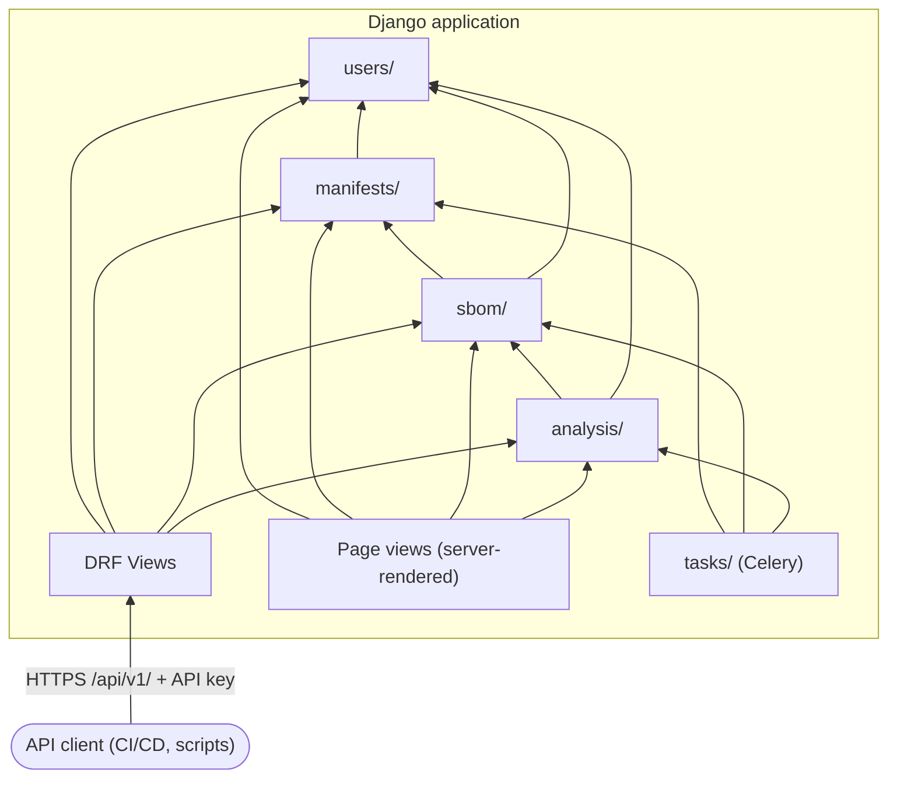
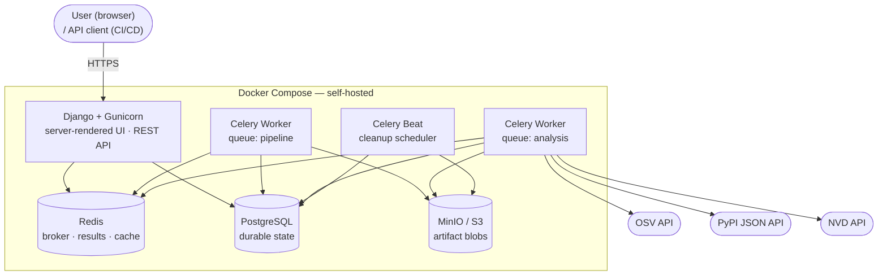
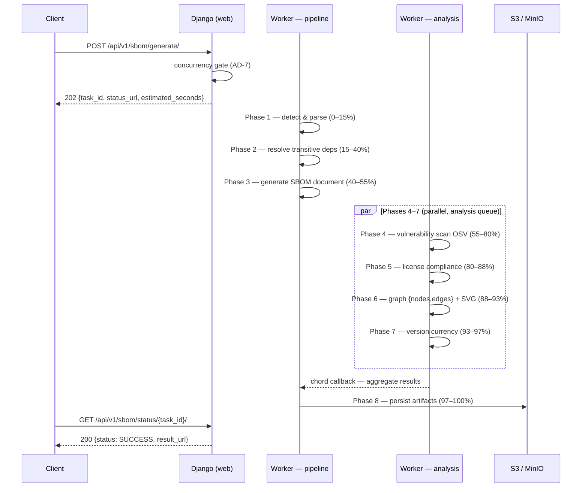
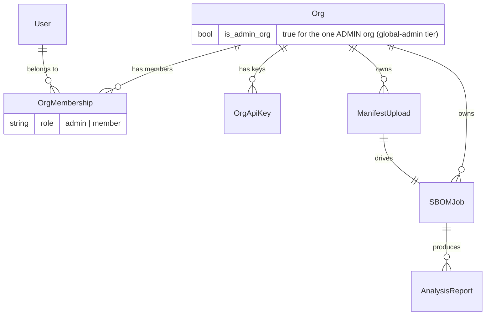

# Architecture Spine — django-python-generate-sbom

## Design Paradigm

**Layered Modular Monolith with Async Pipeline.**

The system is a single deployable Django application. Module boundaries are Django apps; cross-module calls go through Python service functions, never HTTP. A Celery pipeline runs the same service layer functions asynchronously — no duplicate logic between the HTTP and async paths.

Four layers, strict top-to-bottom dependency:

```
Browser / API client   →   Page views + DRF Views   →   Service Layer   →   ORM / External APIs
                                ↑
                        Celery Tasks (same service layer, no HTTP)
```

Server-rendered Django templates are the UI layer (**AD-15**, Epic 21 — superseding the React SPA of AD-5). Page views and DRF views are peers on the same service layer: neither calls the other, and the UI never issues an HTTP request to `/api/v1/`. The versioned REST API remains the contract for programmatic clients.

---

## Invariants & Rules

### AD-1 — Modular monolith: no inter-app HTTP [ADOPTED]

- **Binds:** all Django apps
- **Prevents:** HTTP-to-HTTP calls between Django apps; premature microservice extraction
- **Rule:** All cross-app calls are direct Python imports from the target app's `services.py` or `selectors.py`. No `requests` calls to localhost. No shared task queues used as a coupling mechanism.

### AD-2 — OrgScopedModel: explicit org isolation

- **Binds:** all models owning org data; all service functions; all DRF views
- **Prevents:** cross-org data access; existence leaks on unauthorized access
- **Rule:** Every model owning org data extends `OrgScopedModel` (abstract base with `org` FK + `OrgScopedQuerySet` providing `.for_org(org)`). All queries use `.for_org(org)`. DRF views extract org from the authenticated API key (`request.auth.org`) and pass it as the first positional argument to every service function. **API endpoints** return `404` (never `403`) for cross-org or non-existent object access — `Model.objects.for_org(org).get(pk=pk)` raises `DoesNotExist` for both cases, hiding existence from API consumers. **Web UI routes** apply the same rule via `common/access.get_org_scoped_object_or_404`, which folds the org filter into the query so wrong-org and non-existent are indistinguishable **by construction** — there is no code path that can tell them apart. *(This tightens the original decision, which allowed the UI to answer `403`: a `403`-vs-`404` difference confirms that an object the caller cannot see exists. Authorization failures that reveal nothing — a non-admin on an admin page — still answer `403`.)*

### AD-3 — Service layer purity

- **Binds:** `services.py` and `selectors.py` in all apps
- **Prevents:** HTTP or Celery coupling leaking into business logic; untestable services
- **Rule:** Service functions accept and return plain Python objects only — no `HttpRequest`, no `Response`, no Celery `Task` instance. The same service function must be callable from a DRF view and a Celery task without modification.

### AD-4 — Two Celery queues: `pipeline` and `analysis`

- **Binds:** `tasks/sbom_pipeline.py`, `tasks/analysis.py`, Docker Compose worker definitions
- **Prevents:** long vulnerability scans starving new job submissions from other orgs
- **Rule:** Phases 1–3 (detect, resolve, generate) and Phase 8 (persist) route to the `pipeline` queue. Phases 4–7 (vulnerability, license, graph, version) route to the `analysis` queue. Beat's remaining scheduled task — the weekly conda↔PyPI mapping refresh — routes to `analysis`. *(The nightly artifact purge that this clause was written for was retired by Story 22.6, 2026-08-18: purging is now manual. The `purge_expired_artifacts` task remains registered on the `pipeline` queue for manual dispatch.)* Two separate Celery worker processes, one per queue. A task must never be enqueued to the wrong queue.

### AD-5 — React SPA: REST API only, no Django template coupling [SUPERSEDED by AD-15, Epic 21]

- **Status:** **SUPERSEDED.** Epic 21 replaced the React SPA with server-rendered Django templates and deleted `frontend/` outright (Story 21.19). This decision is retained as the record of what was built and then deliberately reversed; **AD-15 is the binding rule.**
- **Original rule (no longer in force):** The React SPA lived in `frontend/` at the project root (peer to `backend/`) and was built to `frontend/dist/`, which Django's `STATICFILES_DIRS` included. All data flowed through `/api/v1/`; no Django template tag, context processor, or `` passed business data to React components.
- **Why it was reversed:** the SPA duplicated in TypeScript the access control, org scoping, and report rendering the Django service layer already owned, and required a second language and toolchain to maintain. AD-15 keeps the *outcome* AD-5 protected — no business logic in the presentation layer, one contract for programmatic clients — while removing the duplication.

### AD-15 — Server-rendered Django UI: views call the service layer, never the HTTP API

- **Binds:** `src/django_apps/inventory/**/pages.py`, `src/django_apps/inventory/templates/`, `src/django_service/templates/`, `src/config/urls.py`
- **Prevents:** the UI calling the app's own REST API over HTTP (an in-process HTTP hop, forbidden by **AD-1**); business logic migrating into templates or view classes (**AD-3**); the HTML and JSON paths drifting into two different answers for the same question
- **Rule:** The web UI is server-rendered Django templates. A page view calls the **service layer directly** — the same `services.py` / `selectors.py` functions the DRF views call — and **never** issues an HTTP request to `/api/v1/`. Where a behaviour is needed by both, it is extracted into a shared service function so the two paths cannot diverge (e.g. `sbom/services.submit_job`, `analysis/reports.read_report`); a page view must not reimplement logic a DRF view already owns, nor the reverse. Templates receive prepared context, never querysets they must interrogate for business decisions.
  - `/api/v1/` **remains the programmatic contract** for CI/CD and scripted clients, authenticated by API key (**AD-8**). It is not deprecated by this decision and is not a private backend for the UI.
  - Interactivity is progressive: htmx for partial updates and polling, with a working non-JS path where practical. No client-side application framework, no build step, no `node_modules` — vendored assets are committed as files.
  - Server-rendered route names carry a `ui-` prefix where the DRF router already owns the obvious name (`ui-org-switch` vs `org-switch`). Django resolves a duplicate URL name to whichever pattern is registered **last**, which silently pointed an HTML form at a JSON endpoint before this convention existed.

### AD-6 — Storage triad: no artifact blobs in PostgreSQL or Redis [ADOPTED]

- **Binds:** all persistence paths
- **Prevents:** Redis memory exhaustion from artifact blobs; PostgreSQL bloat; stale Redis keys becoming the system of record
- **Rule:** PostgreSQL holds durable models (jobs, keys, reports, org state). Redis holds transient Celery broker messages, task result metadata (keys, not blobs), and TTL-cached external API responses. S3/MinIO holds all binary artifact blobs. Artifact keys (storage paths) are stored in PostgreSQL `SBOMJob.result_key` and `AnalysisReport.artifact_key`; blobs are never written to PostgreSQL or Redis.

### AD-7 — Per-org concurrency gate at enqueue

- **Binds:** `POST /api/v1/sbom/generate/`, `sbom/views.py` — this view owns the generate endpoint and creates both the `ManifestUpload` and `SBOMJob` records before dispatching the pipeline task. (Build-time correction: the view lives in `sbom/views.py`, not `manifests/views.py`, because it creates `SBOMJob` and imports the manifest upload service — the `sbom → manifests` dependency direction (AD-1) requires `sbom` to be the importer. AD-7's invariant is the atomic gate-then-create, not the file location; both records + the gate run in one transaction regardless.)
- **Prevents:** one org exhausting all Celery worker slots
- **Rule:** Before enqueuing, execute `SBOMJob.objects.for_org(org).filter(status__in=['PENDING', 'PROGRESS']).count()`. If the result meets or exceeds `settings.SBOM_MAX_CONCURRENT_JOBS_PER_ORG` (default `5`, set via env var), return `429` with a `Retry-After` header. The count check is not atomic; the occasional over-admission (one extra job) is acceptable at target scale.

### AD-8 — API key via `AbstractAPIKey` subclass [ADOPTED]

- **Binds:** `users/models.py`, DRF authentication class
- **Prevents:** custom crypto code in the auth path; PBKDF2 being used for random-token keys (wrong tool)
- **Rule:** `OrgApiKey` extends `AbstractAPIKey` from `djangorestframework-api-key`, adding `org` FK, `last_used_at`, and `revoked_at`. Library handles key generation, SHA-512 hashing, prefix storage, and the DRF auth class. A custom auth class subclass updates `last_used_at` on each authenticated request and validates that the key's org matches the resource's org.

### AD-9 — Graph API shape: `{nodes, edges}` JSON, no PyVis HTML

- **Binds:** `analysis/services/graph.py`, `GET /api/v1/sbom/result/{task_id}/reports/graph/`
- **Prevents:** PyVis HTML in the API response; iframe in the React UI
- **Rule:** Phase 6 produces two outputs: structured graph JSON for the interactive React view, and a Graphviz SVG for the static download artifact. The graph API endpoint (`GET /api/v1/sbom/result/{task_id}/reports/graph/`) returns JSON with this exact shape (required by Cytoscape.js `data` wrapper convention):

```json
{
  "nodes": [{"data": {"id": "<name>==<version>", "label": "<name>", "version": "<version>"}}],
  "edges": [{"data": {"source": "<node_id>", "target": "<node_id>"}}]
}
```

The SVG is stored in S3 and returned as a separate download via AD-11. No PyVis HTML is generated or served.

### AD-11 — Artifact downloads via presigned URL; never proxied through Django

- **Binds:** `GET /api/v1/sbom/result/{task_id}/`, all analysis report download endpoints
- **Prevents:** artifact blobs flowing through Django process memory; incompatible download strategies between builders
- **Rule:** Artifact downloads return `303 See Other` to a presigned S3/MinIO URL (24-hour TTL). The view fetches `artifact_key` from PostgreSQL via `SBOMJob.objects.for_org(org)`, generates the presigned URL via `django-storages`, and redirects. Django never reads or streams artifact bytes. MinIO in local dev supports the same presigned URL pattern — no special-casing required.

### AD-12 — `SBOMJob.status` written exclusively by Celery task code

- **Binds:** `sbom/services.py`, `tasks/sbom_pipeline.py`, `manifests/views.py`
- **Prevents:** race conditions between view-level and task-level status writes; two owners of the same state field
- **Rule:** `SBOMJob.status` is mutated only by Celery task code, via a dedicated service function in `sbom/services.py`. DRF views read status but never write it. The sole exception: `manifests/views.py` sets the initial `status='PENDING'` at job creation, before `delay_on_commit()` is called.

### AD-10 — `delay_on_commit()` for all task dispatch from views [ADOPTED]

- **Binds:** every Celery task dispatch inside a Django view or signal handler
- **Prevents:** worker reading stale database state before the dispatching transaction commits
- **Rule:** Always use `task.delay_on_commit()` (never `.delay()` or `.apply_async()` without `using=connection`) when dispatching a Celery task from within a database transaction. Use `@shared_task` on all task definitions — no direct Celery app imports in task modules.

### AD-13 — `src/` layout under a pixi umbrella [AMENDED — Epic 21]

- **Binds:** project scaffold, `pyproject.toml`, `pixi.toml`, Docker build, CI, every path reference in tooling
- **Prevents:** a Django scaffold generated at the project root; a second import root competing with the packaging declaration; the runner being bypassed by an out-of-band installer
- **Amendment (Epic 21):** the original rule described `backend/` and `frontend/` as project-root peers with pixi providing a Node runtime. Story 21.1 moved the Django tree to a `src/` layout at the repo root and Story 21.19 deleted `frontend/`, the `nodejs` dependency, and the eight `fe-*` tasks. **Pixi remains the umbrella** — that half of the decision is unchanged and load-bearing; what changed is that there is now one language under it.
- **Rule:** The repository uses a `src/` layout adopted from the **`django-15-factor-base` reference application**, so this project's tree is already the shape of the platform `inventory` is intended to be contributed to:

```text
src/
  config/            # settings/ · urls.py · celery_app.py — Django project configuration
  django_service/    # the HOST project: concrete User, project-wide templates/static, host views
  django_apps/       # PATH ROOT, not a package (no __init__.py) — see AD-16
    inventory/       # the single reusable app
tests/               # at the repo ROOT, not under src/ — unit/ and integration/
```

  - `manage.py`, `pyproject.toml`, `pixi.toml`, `pixi.lock`, `Dockerfile`, `docker-compose.yml`, `Procfile`, `README.md`, and `LICENSE` live at the **repo root**. `BASE_DIR` is the repo root itself — no `.parent` hop.
  - **`APPS_DIR = BASE_DIR / "src" / "django_service"`** is the host-project package, and is the driver of `TEMPLATES["DIRS"]` (`APPS_DIR / "templates"`) and `STATICFILES_DIRS` (`APPS_DIR / "static"`). *(`MEDIA_ROOT` and `STATIC_ROOT` hang off `BASE_DIR`, not `APPS_DIR` — they are deployment paths, not host-package assets.)*
  - **`[tool.hatch.build.targets.wheel] sources` in `pyproject.toml` is the SINGLE import-root declaration site.** Nothing else — not `PYTHONPATH`, not a `conftest.py` `sys.path` insertion, not a `pth` file — may declare an import root, or the checkout and the wheel will disagree about what `inventory` means. See AD-16 for the mapping-vs-array trap.
  - All tasks are `pixi run <task>` from the repo root with **no `cwd`**. Nothing is installed with `pip`, `uv`, or `npm`.
  - **Docker follows the umbrella:** one root `Dockerfile` (build context `.`) installs the pixi environment and runs `collectstatic`; every service (web, `worker-pipeline`, `worker-analysis`, `beat`) runs from that one image via `pixi run <task>`. There is no frontend build stage.
  - `pixi run ci` is the single gate: pre-commit, wheel build, mypy, ruff lint + format-check, bandit, the full test suite with the coverage floor, and the docs build.

### AD-14 — Org/admin/auth model: zero-org identity, per-org vs. global admin [AMENDED — Story 21.24, 2026-08-18]

> **The app no longer authenticates anyone (2026-08-18).** Story 21.24 removed the app's own
> authentication and access control outright — the login, registration and logout surface, the
> three access-control mixins, and the DRF `HasSessionOrApiKey` permission are **deleted**, not
> disabled. Every page and every `/api/v1/` endpoint is reachable without signing in, and an
> anonymous caller acts as a seeded default org (`INVENTORY_DEFAULT_ORG_SLUG`) with org-admin and
> global-admin capability.
>
> **Identity is the host platform's responsibility**, supplied via OIDC and group claims when
> `inventory` is contributed to `django-15-factor-base` (Epics 17-18). The enforcement that was
> removed was the wrong *shape* for that destination — Django session plus local `OrgMembership`
> roles — so it was deleted rather than flagged off; `git log` has the diff.
>
> **What the rules below still describe accurately:** the org/membership *data model*, the
> distinguished ADMIN org, and the rule that the ADMIN org is never a workspace (Story 2.18) —
> which now governs which org a request *acts as* rather than who may see what. **What they no
> longer describe:** every sentence about a principal being refused, gated, or restricted.
>
> **Retained and unaffected:** AD-2 (org isolation — a tenancy invariant, not an authentication
> one), AD-8 (API keys — a presented key still pins the caller to that key's org), and CSRF.

- **Binds:** `inventory/users/` (models, services, selectors, views, `auth.py`); `GET /auth/me/`; `inventory/common/access.py`; every admin-gated API endpoint and page route
- **Prevents:** identity coupled to a single org; ad-hoc or duplicated authorization; a cross-org superuser tier bolted on with special-case branching that bypasses AD-2
- **Rule:**
  - **Zero-org identity.** Registration creates a `User` with **no** org. Identity is resolved via `GET /auth/me/` → `{id, email, is_admin, is_global_admin}`, independent of any active org. The active org lives in the session and **never** resolves to the ADMIN org; a zero-org user has no active workspace (restricted to home).
  - **Two admin scopes.** *Per-org admin* = `OrgMembership(role=ADMIN)`; may add/remove members (add-existing-by-email **or** create-new-user) and **promote/demote** other admins — there is no admin *transfer*. *Global admin* = a member of the single ADMIN org (`Org.is_admin_org=True`), provisioned as a real `OrgMembership(role=ADMIN)` in **every** non-admin org (existing and future). Because a global admin holds a genuine admin membership everywhere, authorization needs no special-casing and AD-2's org isolation is preserved.
  - **Org creation is global-admin-gated.** Only a global admin may create an org (`POST /orgs/create/`); anyone else gets `403`. `create_org` auto-provisions every global admin as an admin of the new org.
  - **Global-admin management.** List / grant-by-email / revoke via `admin/global-admins/`. Grant back-fills the target as an admin of every org (unregistered email → `no_such_user`); revoke removes them from the ADMIN org **and** demotes them to member in every non-admin org, and is blocked if it would remove the **last** global admin. The initial superuser is seeded into the ADMIN org from env config at deploy.
  - **Authorization at both layers.** Every admin-only capability is enforced by the page-view mixin (`OrgAdminRequiredMixin` / `GlobalAdminRequiredMixin` in `inventory/common/access.py`, replacing the SPA's `AdminRoute`) **and** independently re-checked in the API view (`403`: `not_admin` / `not_global_admin`). Hiding a nav link is never the only gate. Admin-ness is per-org and re-evaluated against the **active** org, so switching org can change the answer.

---

### AD-16 — One reusable Django app: `inventory`, imported unqualified

- **Binds:** `src/django_apps/inventory/`, `INSTALLED_APPS`, `[tool.hatch.build.targets.wheel] sources`, every intra-project import
- **Prevents:** the app being importable only under a project-specific prefix (which would make it uncontributable to a host platform); a second import root competing with the packaging declaration; app assets that only resolve because the host project happens to expose them
- **Rule:** All domain code lives in a **single** Django app at `src/django_apps/inventory/`, installed as `"inventory"` and imported **unqualified** (`from inventory.sbom import services`) — never `django_apps.inventory`. Epic 21 collapsed the former `users`/`manifests`/`sbom`/`analysis` apps into it; they survive as **packages inside** the app (`inventory/users/`, `inventory/sbom/`, …), so the Dependency Direction rules below still hold as import rules between packages.
  - `src/django_apps/` is a **path root, not a package**: it carries **no `__init__.py`**. That is what makes `inventory` importable unqualified from a source checkout.
  - The wheel maps it with `"src/django_apps" = "."` in `[tool.hatch.build.targets.wheel.sources]`. The **mapping** form is required: the array form sorts prefixes and strips the first match, so `"src/"` shadows `"src/django_apps/"` and the app ships as `django_apps.inventory` — importable in the checkout and broken in the wheel, with every test still passing. Verify against a built wheel, not against the source tree.
  - The app owns its own `templates/inventory/` and `static/inventory/`, resolved by Django's `APP_DIRS`/`AppDirectoriesFinder`. It must not depend on the host project's `TEMPLATES["DIRS"]` or `STATICFILES_DIRS` to find its own assets.
  - Django discovers management commands only at `<app_module>/management/commands/` — i.e. `inventory/management/commands/`, not inside a sub-package. Tests that invoke command classes directly will not catch a misplacement.

### AD-17 — The app depends on the user *model reference*, never a concrete `User`

- **Binds:** `src/django_apps/inventory/common/users.py`, every model FK and type annotation naming a user, `src/django_service/users/`
- **Prevents:** the reusable app importing a concrete `User` class owned by the host project — the single hardest coupling to remove later, because it reaches into models, migrations, forms, and type annotations at once
- **Rule:** App code refers to the user via `settings.AUTH_USER_MODEL` (model definitions and migrations) and `get_user_model()` (runtime), **never** by importing the concrete class. The concrete `User` is owned by the **host project** at `src/django_service/users/`, and `AUTH_USER_MODEL`'s **value is unchanged** — still `"users.User"`, so no migration or data change was required; what changed is *who may import it*.
  - The single seam is `inventory/common/users.py`, which exports `UserT`, `user_model()`, `user_ref()`, and the creation helpers. Everything else in the app goes through it.
  - `user_ref()` looks like a no-op and is not: it adapts a user to the ORM boundary where a concrete type would otherwise be required. Deleting it as dead code re-introduces exactly the coupling this decision exists to prevent.
  - Migrations that touch a user FK must carry the swappable dependency (`migrations.swappable_dependency(settings.AUTH_USER_MODEL)`), or a host project with a different user model cannot apply them.

### AD-18 — No local workflow and no CI gate may require a container

- **Binds:** every `pixi.toml` task reachable from `pixi run ci`, `pixi run dev` and the inner loop, `.github/workflows/ci.yml`
- **Prevents:** a contributor on Windows being unable to run the application or validate their own change — the team splitting into people who can pass the gate and people who cannot
- **Rule:** Docker and Podman are **unavailable on Windows in the destination organization by security policy**, not by choice. Therefore no task on the path from `pixi install` to a green `pixi run ci` may invoke a container runtime. `tests/unit/test_no_container_contract.py` walks the `ci` task graph transitively and fails if one does.
  - This restricts the **local** path and the **gate**. It does **not** retire containers: Epic 19 ships the same image to OpenShift, and the Compose stack remains the optional prod-parity path locally.
  - The container tasks stay behind the `docker-` prefix, which is what keeps them visibly opt-in. A step that needs a container belongs there, never in the `ci` chain.
  - **Decision on the Compose path (Story 22.5): KEPT, de-emphasised, and explicitly qualified.** `docs/developer/setup.md` presents the containerless flow as the supported local path and states that Compose is unavailable to developers whose organization blocks Docker and Podman. Retiring it was rejected because it is the only local way to exercise PostgreSQL, Redis, and S3-compatible storage against the real backing services before a deployment — the people who *can* run it are the ones who need it.

---

## Dependency Direction

Who may import whom. Arrows point from dependent to dependency. Any import that reverses an arrow is forbidden.


```mermaid
graph BT
    api_client(["API client (CI/CD, scripts)"]) -->|"HTTPS /api/v1/ + API key"| views

    subgraph Django application
        pages["Page views (server-rendered)"] --> users
        pages --> manifests
        pages --> sbom
        pages --> analysis

        views["DRF Views"] --> users
        views --> manifests
        views --> sbom
        views --> analysis

        tasks["tasks/ (Celery)"] --> manifests
        tasks --> sbom
        tasks --> analysis

        analysis --> sbom
        analysis --> users

        sbom --> manifests
        sbom --> users

        manifests --> users

        users["users/"]
        manifests["manifests/"]
        sbom["sbom/"]
        analysis["analysis/"]
    end
```

`users/` is the base layer — it never imports from `manifests/`, `sbom/`, `analysis/`, or `tasks/`.

Since Epic 21 collapsed these into one app (**AD-16**), the boxes are **packages inside `inventory/`** rather than separate Django apps; the arrows remain binding as import rules. Page views and DRF views are **peers**: both call the service layer directly, and neither calls the other (**AD-15**). Page views never appear as a client of `/api/v1/` on this diagram, which is the point.

---

## Consistency Conventions

| Concern | Convention |
|---|---|
| Module naming | Django apps: `snake_case`; service functions: `verb_noun(org, ...)`; selectors: `get_noun_by_x(org, ...)`; tasks: `verb_noun_task` |
| File roles | `views.py` — DRF viewsets only; `services.py` — mutation logic; `selectors.py` — read-only queries; `models.py` — ORM only, no business logic |
| API shape | All endpoints under `/api/v1/`; error envelope `{"error": "<message>", "code": "<snake_case_code>"}` ; dates ISO 8601 UTC; `task_id` is UUID v4 |
| Auth header | `Authorization: Api-Key <key>` on all API requests; unauthenticated requests return `401` |
| Org access in views | `request.auth` is the `OrgApiKey` instance; `org = request.auth.org` — always accessed this way, never from session or query param |
| Org in services | Org is always the first positional parameter of any service or selector function that touches org-owned data: `def generate_sbom(org: Org, manifest_id: UUID, ...)` |
| Storage paths — manifests | `manifest-uploads/{org_id}/{upload_id}/{filename}` |
| Storage paths — artifacts | `sbom-results/{org_id}/{task_id}/{filename}.{ext}` |
| Analysis chord envelope | Each analysis task returns `{"report_type": "vuln|license|graph|version", "artifact_key": "<s3_key>|null", "summary": {...}, "failed": bool, "failure_reason": "<str>|null"}`; chord callback sets `AnalysisReport.failed` and `artifact_key` from these fields |
| Artifact cleanup | `artifacts_expire_at` set at job creation (`completed_at + ARTIFACT_RETENTION_DAYS`, default 30); selector: `SBOMJob.objects.filter(artifacts_expire_at__lte=now(), result_key__isnull=False)`; after storage deletion null `result_key` on `SBOMJob` and `artifact_key` on all related `AnalysisReport` rows; job record is **never** deleted. **Runs only on request** since Story 22.6 — `manage.py purge_expired_artifacts [--dry-run]`; expiry is tracked, not enforced |
| Pagination | `PageNumberPagination`; default `page_size=25`, max 100 via `?page_size=`; envelope: `{"count": N, "next": "<url>\|null", "previous": "<url>\|null", "results": [...]}` |
| Health check | `GET /health/` returns `{"status": "ok"}` with `200`; unauthenticated; used for Docker Compose `healthcheck:` directive |
| Logging | `structlog` with JSON renderer; every log entry binds `org_id`, `task_id` (where applicable), `user_id`; never `print()` or stdlib `logging` |
| Configuration | All config via environment variables through `django-environ`; `.env` file for local dev; never committed secrets |
| Error handling | Never bare `except:`; always catch specific exceptions; log at `error` level before re-raising or returning a domain error; `except SomeError: pass` is forbidden |
| Task state updates | `task.update_state(state='PROGRESS', meta={'progress': N, 'current_step': '<phase name>'})` at the start of each pipeline phase |
| Page views | Server-rendered views live in `pages.py` alongside the app's `views.py` (DRF); they call `services.py`/`selectors.py` directly and never `/api/v1/` (**AD-15**). Route names carry a `ui-` prefix wherever the DRF router owns the plain name |
| Templates | App-owned under `inventory/templates/inventory/`; project-wide under `django_service/templates/`. Multi-line comments use `` — Django's `{# #}` is **single-line only**, and a multi-line one leaks into the HTML while still compiling the tags inside it |
| Tables & filters | django-tables2 + django-filter, sorting and filtering carried in the querystring. `Meta.order_by` names a **column**, not an accessor — naming an accessor silently renders the table unsorted |
| Icons | Semantic names resolved through `django_service/icons.py` and the `` tag; templates never spell out a `bi-*` sprite id |

---

## Stack

| Name | Version |
|---|---|
| Python | 3.14.6 |
| Django | 6.0.6 |
| djangorestframework | 3.17.1 |
| djangorestframework-api-key | 3.1.0 |
| django-storages | 1.14.6 |
| django-environ | 0.14.0 |
| Celery | 5.6.3 |
| structlog | 26.1.0 |
| cyclonedx-python-lib | 11.11.0 |
| lib4sbom | 0.10.4 |
| pip-licenses | 5.5.5 |
| requests-cache | 1.3.2 |
| requests-ratelimiter | 0.10.0 |
| packaging | 26.2 |
| tenacity | 9.1.4 |
| WhiteNoise | 6.12.0 |
| PostgreSQL | 18.4 |
| Redis | 8.8.0 |
| django-crispy-forms | 2.6 |
| crispy-bootstrap5 | 2026.3 |
| django-tables2 | 3.0.0 |
| django-filter | 26.1 |
| openpyxl | 3.1.5 |
| Bootstrap (vendored) | 5.3.8 |
| Bootstrap Icons (vendored SVG sprite subset) | 1.13.1 |
| htmx (vendored) | 2.0.8 |
| pixi | 0.71.0 |

---

## Structural Seed

### System containers


```mermaid
graph TB
    user(["User (browser)<br/>/ API client (CI/CD)"])

    subgraph compose["Docker Compose — self-hosted"]
        web["Django + Gunicorn<br/>server-rendered UI · REST API"]
        worker_p["Celery Worker<br/>queue: pipeline"]
        worker_a["Celery Worker<br/>queue: analysis"]
        beat["Celery Beat<br/>cleanup scheduler"]
        redis[("Redis<br/>broker · results · cache")]
        postgres[("PostgreSQL<br/>durable state")]
        minio[("MinIO / S3<br/>artifact blobs")]
    end

    osv(["OSV API"])
    pypi_api(["PyPI JSON API"])
    nvd(["NVD API"])

    user -->|"HTTPS"| web
    web --> postgres
    web --> redis
    worker_p --> redis
    worker_p --> postgres
    worker_p --> minio
    worker_a --> redis
    worker_a --> postgres
    worker_a --> minio
    worker_a --> osv
    worker_a --> pypi_api
    worker_a --> nvd
    beat --> postgres
    beat --> minio
```

### Async pipeline flow


```mermaid
sequenceDiagram
    participant C as Client
    participant W as Django (web)
    participant P as Worker — pipeline
    participant A as Worker — analysis
    participant S as S3 / MinIO

    C->>W: POST /api/v1/sbom/generate/
    W->>W: concurrency gate (AD-7)
    W-->>C: 202 {task_id, status_url, estimated_seconds}
    P->>P: Phase 1 — detect & parse (0–15%)
    P->>P: Phase 2 — resolve transitive deps (15–40%)
    P->>P: Phase 3 — generate SBOM document (40–55%)
    par Phases 4–7 (parallel, analysis queue)
        A->>A: Phase 4 — vulnerability scan OSV (55–80%)
        A->>A: Phase 5 — license compliance (80–88%)
        A->>A: Phase 6 — graph {nodes,edges} + SVG (88–93%)
        A->>A: Phase 7 — version currency (93–97%)
    end
    A-->>P: chord callback — aggregate results
    P->>S: Phase 8 — persist artifacts (97–100%)
    C->>W: GET /api/v1/sbom/status/{task_id}/
    W-->>C: 200 {status: SUCCESS, result_url}
```

### Core entity relationships


```mermaid
erDiagram
    Org {
        bool is_admin_org "true for the one ADMIN org (global-admin tier)"
    }
    OrgMembership {
        string role "admin | member"
    }
    Org ||--o{ OrgMembership : "has members"
    Org ||--o{ OrgApiKey : "has keys"
    Org ||--o{ ManifestUpload : "owns"
    Org ||--o{ SBOMJob : "owns"
    User ||--o{ OrgMembership : "belongs to"
    ManifestUpload ||--|| SBOMJob : "drives"
    SBOMJob ||--o{ AnalysisReport : "produces"
```

A `User` may hold **zero** memberships (zero-org identity, AD-14). Exactly one `Org` has `is_admin_org=True` — the **ADMIN org**; its members are **global admins**, each carrying a real `OrgMembership(role=admin)` in every non-admin org, so the ERD needs no separate global-admin entity.

### Source tree

```text
django-python-generate-sbom/          ← repo root == BASE_DIR (pixi umbrella, Python only)
  pixi.toml                           # the single environment + every task; no cwd, no npm
  pixi.lock
  pyproject.toml                      # Python tool config, package metadata, and the ONLY
                                      # import-root declaration (hatch wheel `sources`) — AD-13
  manage.py
  Dockerfile                          # build context "." — one image for web/worker/beat
  docker-compose.yml · Procfile · README.md · LICENSE
  src/
    config/                           ← Django project configuration
      settings/                       # base.py · local.py · test.py · production.py
      celery_app.py
      urls.py
    django_service/                   ← the HOST project (APPS_DIR)
      users/                          # the CONCRETE User — owned here, not by the app (AD-17)
      templates/                      # base.html · landing.html · _nav.html · 404/500
      static/                         # vendored Bootstrap · htmx · icons.svg · theme.js
      templatetags/ui_icons.py        #  — registered via TEMPLATES OPTIONS
      icons.py                        # semantic icon map (nav · tab · action · chrome)
      views.py                        # landing page · org switcher · shell preview
    django_apps/                      ← PATH ROOT, no __init__.py (AD-16)
      inventory/                      ← the single reusable app, imported as `inventory`
        users/                        # Org · OrgMembership · OrgApiKey · auth · pages (F1, F2)
        manifests/                    # ManifestUpload · upload · format detection (F3)
        sbom/                         # SBOMJob · generation · pages.py · tables.py (F4, F6, F7)
          parsers/                    # requirements · pyproject · pixi_lock · pixi_toml · conda
        analysis/                     # AnalysisReport · reports.py · tables.py · excel.py (F5)
          services/                   # vulnerability.py · license.py · versions.py
        tasks/
          sbom_pipeline.py            # 8-phase Celery chain (pipeline queue)
          analysis.py                 # parallel analysis group (analysis queue)
        common/                       # users.py (the AD-17 seam) · access.py · storage.py
        management/commands/          # must sit at the APP ROOT — Django looks nowhere else
        templates/inventory/          # app-owned; resolved by APP_DIRS, not by the host
        static/inventory/
        migrations/
  tests/                              ← at the ROOT, not under src/
    unit/                             # mirrors the src/ structure; no I/O
    integration/                      # real DB · broker='memory://' · @pytest.mark.integration
    fixtures/                         # incl. the exceljs reference workbook (Story 21.17)
```

## Capability → Architecture Map

| Capability | Lives in | Governed by |
|---|---|---|
| F1 — Account & Org Management | `inventory/users/` | AD-2 (org isolation), AD-8 (API key), AD-14 (org/admin/auth model), AD-17 (user reference) |
| F2 — API Key Management | `inventory/users/` | AD-8 (AbstractAPIKey subclass) |
| F3 — Manifest Upload & Job Submission | `inventory/manifests/`, `inventory/sbom/` | AD-2, AD-7 (concurrency gate), AD-3 (service purity), AD-15 |
| F4 — SBOM Generation Pipeline | `inventory/sbom/`, `inventory/tasks/sbom_pipeline.py` | AD-4 (queue topology), AD-3, AD-10 (delay_on_commit) |
| F5 — Analysis Reports | `inventory/analysis/`, `inventory/tasks/analysis.py` | AD-4, AD-3, AD-6 (storage) |
| F6 — Results Web UI | `inventory/sbom/pages.py`, `inventory/analysis/`, `inventory/templates/inventory/sbom/` | AD-15 (server-rendered), AD-16 (single app), AD-13 (`src/` layout) |
| F7 — Job History Dashboard | `inventory/sbom/pages.py`, `inventory/sbom/tables.py` | AD-15, AD-2 (org scoping), AD-16 |
| F8 — Artifact Retention & Cleanup | `inventory/tasks/`, all packages | AD-6 (storage triad), AD-4 (Beat on separate schedule) |

---

## Deferred

- **Nginx vs WhiteNoise-only** for production static serving — operator choice; WhiteNoise is the default in Docker Compose
- **Celery worker `--concurrency` settings** — operator choice per hosting capacity; documented in README, not fixed here
- **Per-app URL routing patterns** — story-level detail; bound only by `/api/v1/` prefix (Consistency Conventions)
- **Model field types and indexes** — story-level; only relationship shape is fixed (ERD above)
- **SPDX 3.0 output path** — deferred in PRD; no architecture impact beyond adding a new serializer in `sbom/services.py`
- **WebSocket / Django Channels** — deferred in PRD; the htmx polling architecture (**AD-15**) does not block this addition
- **`uv.lock` / `poetry.lock` parsers** — deferred in PRD; add modules to `sbom/parsers/` with no structural change
- **OAuth / SSO** — deferred in PRD; plugs into DRF auth class layer without touching AD-8's key model
- **Cleanup queue** — a third `cleanup` Celery queue for Celery Beat jobs; trivial to add alongside AD-4's two queues if Beat jobs compete with user traffic
- **Authentication and authorization** — **removed on purpose** (Story 21.24, 2026-08-18) and to be
  supplied by the host platform via OIDC + group claims (Epics 17-18). Not a gap to be filled
  ad hoc: re-adding an app-owned session/role gate would rebuild exactly what was deleted. See the
  amendment note on **AD-14**.
- **Pluggability into a `django-15-factor-base` platform** — explicit future intent (**AD-16**, **AD-17**), **not** implemented. Four known violations remain, each of which would force a host project to accept this app's opinion:
  - `src/config/settings/base.py` — a **global** `DEFAULT_AUTHENTICATION_CLASSES` and `DEFAULT_PERMISSION_CLASSES` (`"inventory.users.authentication.HasSessionOrApiKey"`), imposing the app's auth on *every* DRF view a host adds. Should be declared per-viewset.
  - `src/config/settings/base.py` — `config` imports the app's `configure_structlog` directly, so the project's logging setup depends on the app rather than the reverse.
  - `src/config/settings/production.py` — `STORAGES["default"]` names an **app-owned** backend (`inventory.common.storage.PublicEndpointS3Storage`), making the host's default file storage the app's choice.

  Also **not** implemented, and required before contribution: the contribution module, `component.toml`, `src/config/startup/` composition, `django_service.__api_version__`, the navigation registry, and an adoption-gate test that would fail on any of the above.
- **AD-9 and the dependency-graph stack entries are stale and were left alone** — Story 20.1 retired the dependency graph (`analysis/services/graph.py` is gone; NetworkX, pygraphviz, and the three Cytoscape packages are no longer dependencies) but never reconciled the spine. The Cytoscape rows were removed here because Story 21.20's AC #4 names them; **AD-9 itself still describes a graph API that no longer exists** and needs its own correct-course pass on Epic 20 rather than a silent edit from an Epic 21 story.
- **Scheduled artifact purging** — **removed on purpose** (Story 22.6, 2026-08-18), amending **FR-8.2**, which
  specified an unattended nightly sweep. Deleting artifacts is now a deliberate act taken after reviewing what
  would go (`manage.py purge_expired_artifacts --dry-run`). `artifacts_expire_at` still marks eligibility on
  every job, so re-adding a schedule is a one-entry change if the decision is ever reversed — but do not add one
  without the product owner, and see **AD-4**'s note on which queue it belonged to.
