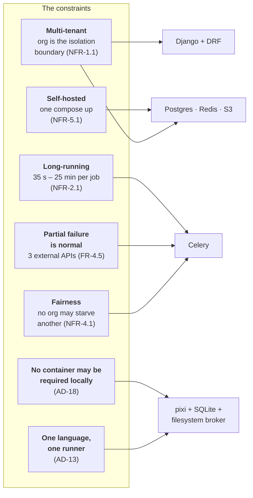
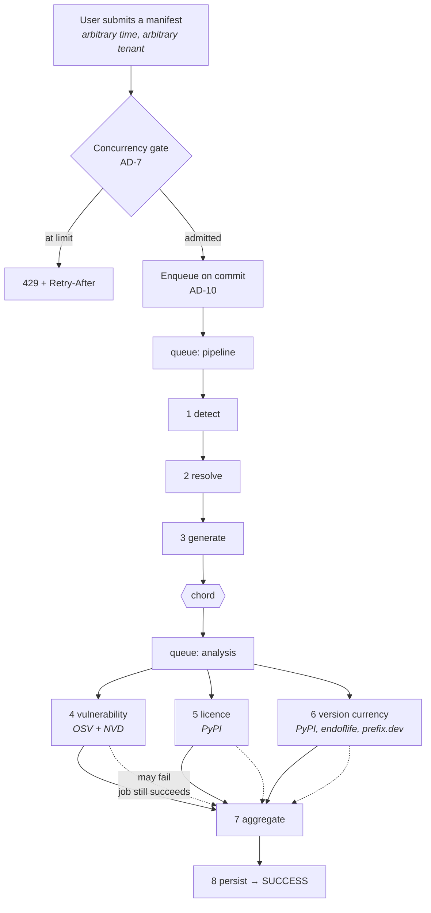
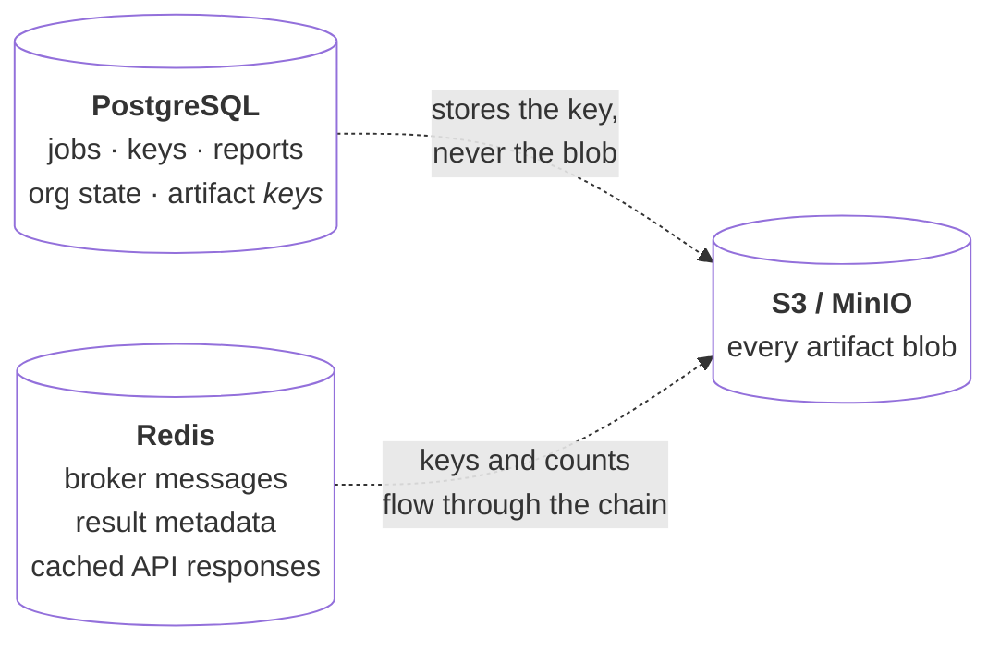

# Technology Stack Rationale

Why this system is built from these particular pieces — the forces that constrained each
choice, the alternatives weighed against them, and the conditions under which a decision
should be reopened.

This is the **why** document. For *what* is in the stack and at which version floor, see
[Tech Stack](tech-stack.md); for *how* the pieces fit together, see
[Architecture](architecture.md).

---

## Provenance of these decisions

This page draws on the BMAD planning artifacts under `_bmad-output/`, principally:

| Source | What it contributes |
| --- | --- |
| `planning-artifacts/architecture/…/ARCHITECTURE-SPINE.md` | The binding decisions AD-1 … AD-21 |
| `planning-artifacts/architecture/…/solution-design.md` | The pipeline canvas, queue topology, storage paths |
| `planning-artifacts/research/technical-…-research-2026-07-03.md` | The pre-build technology survey and its citations |
| `planning-artifacts/prds/…/prd.md` | The functional and non-functional requirements the stack must satisfy |

!!! warning "Two kinds of statement in this document, kept apart on purpose"
    **Recorded decisions** cite an AD number or a named artifact. These were taken during
    planning and are binding.

    **Assessments** are marked as such. They are comparisons written *now*, against the
    recorded requirements, for alternatives the original research did not examine. They
    are reasoning, not history — and the **Celery vs. Kedro** comparison in
    [§4](#4-async-execution-celery) is one of them.

    Kedro appears **nowhere** in the planning artifacts, the source tree, or the
    dependency manifests. It was never evaluated at the time. §4.3 onward is therefore the
    case *as it stands today*, not a reconstruction of a decision that was made. That
    distinction matters: an architecture record that quietly invents its own history stops
    being trustworthy for the decisions it *did* capture.

---

## 1. The forces

Every choice below was made against the same small set of constraints. They come from the
PRD's non-functional requirements and from the deployment reality of the destination
organisation.

Two of these deserve emphasis, because they eliminate more candidates than anything else:

**Long-running with visible progress.** A job takes between 35 seconds and 25 minutes
(NFR-2.1). The submitting HTTP request must return in milliseconds with a `202`, and the
browser then polls every five seconds for a progress reading that is *derived from real
work completed* (AD-20). Anything that cannot report intermediate state per unit of work
is disqualified.

**No container may be required.** Docker and Podman are unavailable on Windows in the
destination organisation **by security policy** (AD-18). No task on the path from
`pixi install` to a green `pixi run ci` may invoke a container runtime — and
`tests/unit/test_no_container_contract.py` walks the task graph and fails if one does.
This is the constraint that quietly rules out most of the heavyweight orchestrators.

---

## 2. Decisions at a glance

| Concern | Chosen | Alternatives weighed | The deciding constraint | Recorded as |
| --- | --- | --- | --- | --- |
| Web framework | **Django + DRF** | Flask/FastAPI + separate ORM | One project owning ORM, admin, templates, and API; multi-tenancy in the query layer | AD-1, AD-2 |
| Async execution | **Celery** | Django 6 Tasks *(recorded)*; RQ/Dramatiq/Huey, Airflow/Prefect/Dagster, **Kedro** *(assessed here)* | Queue routing + admission control + partial-failure primitives | AD-4, AD-10 |
| Module boundaries | **Modular monolith** | Microservices | No inter-service HTTP; one deployable | AD-1 |
| UI | **Server-rendered + htmx** | React SPA — *built, then reversed* | Removing a second language and a duplicated authorization layer | AD-15 (supersedes AD-5) |
| Durable state | **PostgreSQL** (SQLite locally) | — | Relational, transactional, one system of record | AD-6 |
| Broker / cache | **Redis** (filesystem locally) | RabbitMQ | Doubles as the external-API response cache | AD-6, Story 20.4 |
| Blob storage | **S3 / MinIO** via django-storages | Blobs in Postgres or Redis | Presigned downloads; Django never streams bytes | AD-6, AD-11 |
| API keys | **djangorestframework-api-key** | Hand-rolled tokens | No custom crypto in the auth path | AD-8 |
| SBOM writers | **cyclonedx-python-lib** + **lib4sbom** | Single-library, or hand-rolled JSON | Each is the reference implementation of its own standard | Research §SBOM tooling |
| Resolver | **`uv pip compile`** / **`pixi lock`** | pip-tools, conda/mamba | Speed, and paths-not-content as subprocess arguments | AD-3, NFR-3.1 |
| Toolchain | **pixi** (conda-forge) | pip + venv, uv, Poetry | One environment for Python *and* the win-64 solve | AD-13 |

---

## 3. The framework: Django

The application is a **layered modular monolith** — one deployable, with module
boundaries enforced as import rules rather than network calls (AD-1).

Django earns its place on three specific counts, not on general popularity:

1. **Tenancy belongs in the query layer.** AD-2 makes the org the isolation boundary and
   implements it as `OrgScopedModel.for_org(org)`. Because the filter is folded *into the
   query*, "belongs to another org" and "does not exist" become the same miss by
   construction — there is no separate check to forget. That is an ORM-level property; it
   is far harder to guarantee when persistence is a thin layer over hand-written SQL.
2. **One project, both entry points.** The server-rendered UI and the `/api/v1/` contract
   are peers on a single service layer (AD-15). A page view calls `services.py` directly
   and never issues an HTTP request to its own API. One framework covering templates,
   forms, tables, and REST is what makes that cheap.
3. **The destination is a Django platform.** AD-16 and AD-17 exist so `inventory` can
   eventually be contributed to a `django-15-factor-base` host as a reusable app. The
   framework choice was never really open — it is the target platform's framework.

**DRF** supplies the API layer, `drf-spectacular` the OpenAPI schema, and
`drf-spectacular-sidecar` the Swagger assets locally rather than from a CDN — consistent
with the no-CDN rule the vendored front-end assets follow.

---

## 4. Async execution: Celery

This is the decision the rest of the pipeline architecture hangs from, so it gets the most
space.

### 4.1 What the workload actually is

Before comparing tools, it is worth being precise about the shape of the work, because
that shape is what decides the answer.

Seven properties, each of which constrains the choice:

| # | Property | Consequence |
| --- | --- | --- |
| 1 | **Triggered per user request**, at unpredictable times | Needs a queue and workers, not a scheduled run |
| 2 | **Multi-tenant**, with per-org admission control (AD-7) | Needs a gate *at enqueue*, before work is created |
| 3 | **Two workload classes** — fast pipeline phases, slow external-API phases | Needs routing to independently scaled workers (AD-4) |
| 4 | **Fan-out of exactly 3**, then a join | Needs a group/chord primitive |
| 5 | **Partial failure is expected and tolerated** (FR-4.5) | A failed analysis phase must not abort the job |
| 6 | **Live progress** derived from completed units (AD-20) | Needs stable per-task identity to write state against |
| 7 | **Soft and hard timeouts** (25/30 min) with a failure path | Needs the executor to enforce and signal both |

**The DAG itself is trivial.** Eight nodes, one fan-out, one join, and it has not changed
shape since the original design. The complexity in this system is *operational* —
tenancy, fairness, retries, timeouts, partial failure, progress — not *topological*.

That single observation is the crux of the comparison that follows.

### 4.2 What Kedro is, and what it is for

[Kedro](https://kedro.org/) is an opinionated Python framework for authoring
**reproducible data-science and data-engineering pipelines**. Its core concepts:

- **Nodes** — pure Python functions with declared inputs and outputs.
- **Pipeline** — a DAG assembled from nodes, resolved by dependency on named datasets.
- **DataCatalog** — a *declarative* YAML mapping of dataset names to storage locations and
  types, with optional versioning.
- **Config** — `conf/base` + `conf/local`, loaded through OmegaConf.
- **Runners** — `SequentialRunner`, `ThreadRunner`, `ParallelRunner`; all execute one
  pipeline run **in process**.
- **Deployment** — serious production use targets an external orchestrator (Airflow,
  Argo, Databricks, Kubeflow) via plugins.

Kedro's value proposition is **structure, reproducibility, and lineage** for analytical
code that would otherwise be a pile of notebooks. It is a *pipeline authoring* framework.

Celery is a *distributed task execution* system: brokers, worker processes, queues,
routing, retries, time limits, result backends, and the canvas primitives
(`chain`, `group`, `chord`).

!!! note "They are not the same layer"
    Kedro and Celery are not straightforwardly competitors. Kedro has no broker, no worker
    daemon, and no notion of a queue; Celery has no dataset catalog and no opinion about
    how you structure your functions. The honest question is not "Kedro *or* Celery" but:

    **"Should the eight-phase pipeline be authored as a Kedro DAG, executed inside
    something that still has to be a task queue?"**

    Answering it that way is what makes the trade-offs visible.

### 4.3 The comparison — *assessment*

Scored against the seven properties from §4.1.

| Requirement | Celery | Kedro | Notes |
| --- | --- | --- | --- |
| 1 · Per-request trigger | ✅ Native — `delay_on_commit()` | ❌ None | `kedro run` is a CLI/scheduler entry point; a queue is still required to trigger it |
| 2 · Admission control at enqueue (AD-7) | ✅ Gate before dispatch | ❌ No enqueue step to gate | There is no submission boundary in Kedro to attach a per-org count to |
| 3 · Queue routing, independent workers (AD-4) | ✅ `queue=` per task, two worker processes | ❌ In-process runners only | Cannot express "slow scans must not starve new submissions" |
| 4 · Fan-out + join | ✅ `chord(group(...), callback)` | ✅ DAG-native | Kedro's genuine strength — but three parallel nodes is not where a DAG framework pays off |
| 5 · Partial failure tolerated (FR-4.5) | ✅ Each task returns an envelope; the chord still fires | ⚠️ Fail-fast by default | Continuing past a failed node while still materialising downstream outputs needs custom hook machinery |
| 6 · Per-unit progress (AD-20) | ✅ Stable task identity → `JobTask` rows | ⚠️ Possible via hooks | `before_node_run` / `after_node_run` could emit it — but the job-state model is ours either way, so Kedro adds nothing |
| 7 · Soft + hard time limits | ✅ Built in, with a failure signal | ❌ Not a concern of the framework | Would have to be imposed by whatever executes the run |
| — · Runs containerless on Windows (AD-18) | ✅ Filesystem broker, `--pool=solo` | ⚠️ Yes in-process — but its production story is Airflow/Argo/Databricks | Every one of those is a container dependency the local path forbids |
| — · Already in the environment | ✅ Present, win-64 conda-forge solve | ❌ New dependency tree | Adds weight for orchestration we do not need |

### 4.4 Where Kedro would actually break

Four of the rows above are not preferences; they are structural.

**It does not remove the queue — it adds a layer above one.** Jobs arrive when a user
uploads a file. Something must accept the submission, return `202` immediately, and run
the work elsewhere. Kedro has no answer for that; it assumes something else decided to
start a run. The realistic architecture is therefore *Kedro inside Celery* — a Celery task
that shells into a Kedro pipeline. That keeps every operational concern exactly where it
is and adds a framework on top, in exchange for a DAG we can already read in fifteen lines
of `build_pipeline()`.

**AD-4 is inexpressible.** The whole reason there are two queues is that a vulnerability
scan against OSV can run for minutes while new submissions from other orgs need to start
promptly. Celery expresses that as two queues drained by two worker processes that scale
independently. Kedro's runners are in-process within a single run — `ParallelRunner` uses
multiprocessing inside that one run. There is no cross-process queue to route between, so
the isolation AD-4 exists to provide simply has nowhere to live.

**The DataCatalog is the wrong shape for per-tenant artifacts.** AD-6 puts every blob at
`sbom-results/{org_id}/{task_id}/{filename}` — a path computed at runtime from the tenant
and the job. Kedro's catalog is a *declarative, mostly static* mapping resolved from
config; per-tenant dynamic paths fight it directly and end up as runtime-parameterised
templating on every dataset entry. Meanwhile `django-storages` already gives us one
storage abstraction that swaps filesystem for S3 by settings alone, with the org scoping
written into the key. We would be replacing a working abstraction with one that has to be
bent.

**It collides with the project's structural invariants.** `kedro new` scaffolds an entire
project layout with its own `conf/` tree and configuration loader. This repository has a
single import root declared in exactly one place (AD-13, AD-16), one config mechanism —
django-environ into Django settings (NFR-5.2) — and one runner, pixi (AD-13). Kedro's
project structure is not something that drops inside a reusable Django app destined for
contribution to a host platform (AD-16); it would arrive as a second, parallel notion of
what "the project" is.

**And the one thing Kedro is most praised for, we already have.** Kedro nodes are pure
functions with declared inputs and outputs. AD-3 already requires exactly that of the
service layer: service functions take and return plain Python objects, with no
`HttpRequest`, no `Response`, and no Celery `Task` — and the same function must be
callable from a view and from a task without modification. That property is enforced today
by a convention and a test, at zero dependency cost. Adopting Kedro to obtain it would be
paying a framework for a discipline we already keep.

### 4.5 What Kedro would genuinely be better at

A comparison that finds no merit in the alternative is not a comparison. Kedro would be
the better tool if the work looked different in specific, nameable ways:

- **Lineage and reproducibility as first-class outputs.** Kedro's catalog and dataset
  versioning make "which exact inputs produced this artifact, and can I re-run it" a
  framework guarantee rather than something we maintain.
- **Pipeline visualisation for free.** `kedro-viz` renders the DAG from the code. We
  hand-maintain `PIPELINE_TASKS` as the single declaration of the pipeline's shape and
  keep it in sync with `build_pipeline()` by convention.
- **Many pipelines over shared datasets.** Kedro's structure pays off when there are
  dozens of related pipelines with overlapping inputs — not one fixed pipeline of eight
  nodes.
- **Analytical evolution.** If the product's centre of gravity moved from *"generate one
  SBOM per upload"* to *"run fleet-wide analytics across every org's accumulated SBOM
  history"* — trend analysis, drift detection, models trained on vulnerability data — that
  is Kedro's home ground, and this assessment would need reopening.

That last one is the realistic trigger, and it is listed in §4.7.

### 4.6 The alternatives that *were* considered

For completeness, and to be clear about which comparison is historical:

**Django 6.0's built-in task framework** — the one alternative the original research
actually weighed. It concluded:

> Django 6.0 built-in task framework is a lighter-weight alternative to Celery available
> if Celery's operational overhead is a concern. However, it lacks the ecosystem maturity,
> retry logic, rate limiting, and result backend features needed for production SBOM
> processing at scale. Celery remains the recommended choice.
>
> — `research/technical-python-sbom-generation-django-integration-research-2026-07-03.md`

That reasoning has held. The `chord` in §4.1 and the soft/hard time-limit handling in
`_phase_guard` are precisely the features named as missing.

**RQ, Dramatiq, Huey** *(assessment)* — genuine task queues, and lighter than Celery. Each
would satisfy properties 1–3. The gap is property 4: none offers a canvas as complete as
`chain`/`group`/`chord`, and the chord callback with per-task failure envelopes is the
mechanism FR-4.5's partial-failure tolerance is built on. Reimplementing a join with
partial-failure semantics is not a saving.

**Airflow, Prefect, Dagster** *(assessment)* — scheduler-first orchestrators aimed at
recurring batch workloads. Wrong trigger model for per-request work, and each brings an
operational footprint (a scheduler, a metadata database, a web service) that contradicts
NFR-5.1's single `docker compose up` and AD-18's containerless local path.

### 4.7 When to revisit

Reopen the Celery decision if any of these becomes true:

1. The pipeline's **topology** becomes genuinely complex — conditional branches, dozens of
   nodes, per-tenant variation in shape. Today it is eight fixed nodes.
2. The product grows a **second centre of gravity in analytics** — fleet-wide or historical
   analysis over accumulated SBOMs, where dataset lineage and reproducibility become
   product features rather than implementation details.
3. **Reproducibility becomes a compliance requirement** — "re-run this exact SBOM against
   these exact inputs and prove the output matches."

Note that (1) and (2) argue for adding Kedro *inside* the Celery task, not for replacing
Celery. The queue, the gate, the routing, and the timeouts stay regardless.

---

## 5. Data and storage: the triad

AD-6 splits persistence three ways and forbids the crossings:

**Why blobs never touch Postgres or Redis.** A generated SBOM for a large project runs to
megabytes. Putting those in the Celery result backend exhausts Redis memory; putting them
in Postgres bloats the database and its backups. Only the storage *key* threads through
the chain — a rule visible throughout the pipeline code, where Phase 3 writes the blob and
passes a key onward.

**Why S3-compatible rather than a filesystem volume.** AD-11: downloads are a `303` to a
presigned URL with a 24-hour TTL, and Django never reads or streams artifact bytes.
MinIO supports the identical presigned pattern locally, so there is no special-casing
between dev and production. The one wrinkle — the internal endpoint (`minio:9000`) is not
reachable from a user's browser — is handled by `PublicEndpointS3Storage` rewriting the
host, rather than by a code path that differs per environment.

**Why Redis specifically**, over RabbitMQ: it serves two purposes at once. It is the
Celery broker *and* the shared `requests-cache` backend for external API responses across
analysis workers (FR-5.5). RabbitMQ would be the better pure broker; it would not remove
the need for a cache.

**Why SQLite and a filesystem broker exist locally.** AD-18 again. `pixi run dev` runs
web + worker + beat against one SQLite file with a Kombu `filesystem://` broker and the
`django-db` result backend — no Redis, no Postgres, no MinIO, no container. That path
required one non-obvious setting: SQLite's default deferred `BEGIN` produced "database is
locked" on three of four concurrent read-then-write transactions, and only
`transaction_mode = "IMMEDIATE"` fixed it. WAL alone did not.

---

## 6. The UI: server-rendered, and the SPA that was reversed

This is the stack's most instructive decision, because it was made, built, and then
deliberately undone.

**AD-5** (original): a React SPA in `frontend/`, talking only to `/api/v1/`.
**AD-15** (current): server-rendered Django templates; page views call the service layer
directly and never the HTTP API.

The spine records why it was reversed:

> the SPA duplicated in TypeScript the access control, org scoping, and report rendering
> the Django service layer already owned, and required a second language and toolchain to
> maintain. AD-15 keeps the *outcome* AD-5 protected — no business logic in the
> presentation layer, one contract for programmatic clients — while removing the
> duplication.

What the reversal bought, concretely: the Node runtime, `node_modules`, a second dev
port, and a build step all left the repository (Story 21.19) — which is also what made
AD-18's containerless, one-runner contract achievable. What it kept: `/api/v1/` is still
the programmatic contract for CI/CD clients, not a private backend for the UI.

**htmx and vendored Bootstrap** carry the interactivity that remains — polling for job
progress and swapping tab panels — with no build step and every asset committed as a
file. Two consequences of that choice are load-bearing enough to have caused bugs:
polling triggers are emitted from exactly one function so a finished job comes back
without one, and the tab strip is swapped together with its body so the highlighted tab
cannot disagree with what is shown.

---

## 7. Toolchain: pixi, and the no-container contract

**pixi** is the single environment and task runner for the whole project (AD-13). Not pip,
not uv, not Poetry, and — since Story 21.19 — no npm.

The decisive reason is **win-64**. The destination organisation blocks Docker and Podman
on Windows by security policy (AD-18), so Windows must be a first-class development
platform running the real application: web, worker, and beat. pixi resolves a genuine
cross-platform lock across `linux-64`, `osx-arm64`, and `win-64` from conda-forge, which
is what makes a single `pixi install` produce a working stack on all three. Platform-specific
needs are scoped rather than special-cased — `gunicorn` to the Unix platforms, `pywin32`
to Windows, where Kombu's filesystem transport imports it unconditionally.

`pixi run ci` is the one gate: pre-commit, wheel build, mypy, ruff, bandit, the full test
suite with its coverage floor, and the docs build. `tests/unit/test_no_container_contract.py`
walks that task graph transitively and fails if any step reaches for a container runtime.

Containers are not retired — Epic 19 ships the same image to OpenShift, and the Compose
stack remains the optional prod-parity path for developers who can run it. They are simply
never *required*.

---

## 8. SBOM generation libraries

Two libraries rather than one, because each is the reference implementation of its own
standard:

| Format | Library | Why |
| --- | --- | --- |
| CycloneDX 1.6 (JSON + XML) | **cyclonedx-python-lib** | Maintained by the CycloneDX project; models the spec as objects rather than emitting hand-built dicts |
| SPDX 2.3 (JSON) | **lib4sbom** | Covers SPDX document/package/relationship construction |

Hand-rolling either format was rejected in research: both specifications have enough
structure — supplier metadata, external references, licence expressions, relationship
graphs — that a hand-built serialiser becomes a partial reimplementation of the spec with
no conformance testing behind it.

The serialisers are kept **pure and I/O-free**: packages, provenance, and a
pre-resolved licence map in; bytes out. Licence lookup is I/O, so it happens in the
calling task and the result is handed to the serialiser. That is AD-3 applied at the
narrowest scope, and it is what makes SBOM generation testable without a network.

**Resolution** uses `uv pip compile` for PyPI-shaped manifests and `pixi lock` for conda
environments. `uv` is chosen for speed and because it accepts a file path — the wrapper
passes **paths only, never manifest content, as subprocess arguments** (NFR-3.1). Conda
environments are converted to a pixi workspace and solved with pixi's own resolver rather
than shelling out to conda or mamba, which keeps one solver in the stack instead of two.

---

## 9. Analysis: caching, rate limiting, and retries

Three libraries compose into one session type that every external call goes through:

| Library | Role |
| --- | --- |
| **requests-cache** | Response caching, keyed by URL. Because the data is public, one cache is safely shared across all orgs (FR-5.5) |
| **requests-ratelimiter** | Per-host rate limits — OSV 1/s, PyPI 5/s (NFR-4.2) |
| **tenacity** | Retry with exponential backoff on transient `RequestException` |

`CachedLimiterSession` combines the first two with `requests.Session` and supplies a
**default connect/read timeout**. That last part is not decoration: `requests` has no
default timeout, and an accepted-but-unanswered connection blocked the Windows worker
three times on CI with no output at all. The timeout lives on the session rather than at
each call site precisely because the call sites are what went wrong — a dozen untimed
calls across three modules.

The data sources — **OSV** for vulnerabilities with **NVD** for CVSS/CWE enrichment,
**PyPI JSON** for licences and latest versions, **endoflife.date** for LTS series, and
**prefix.dev** for conda-forge versions — are all public APIs requiring no key, which is
what keeps the deployment story a single `docker compose up` with no credential
provisioning.

---

## 10. Decisions that were reversed

Recording these matters as much as recording the choices that stuck. Each is a decision
the project made, shipped, and then deliberately undid.

| Decision | Status | Why it was undone |
| --- | --- | --- |
| React SPA (AD-5) | **Superseded** by AD-15 | Duplicated access control and rendering in a second language |
| Dependency graph phase (AD-9) | **Retired**, Story 20.1 | Removed NetworkX, pygraphviz, and three Cytoscape packages; the spine entry is knowingly stale and awaits its own correct-course pass |
| App-owned authentication (AD-14) | **Removed**, Story 21.24 | The wrong *shape* for the destination: Django session + local roles, where the host platform will supply OIDC + group claims. Deleted rather than flagged off |
| Nightly artifact purge (FR-8.2) | **Removed**, Story 22.6 | Deleting artifacts became a deliberate, reviewable act (`--dry-run`) rather than an unattended sweep |
| Per-phase progress percentages | **Replaced**, AD-20 | Hand-picked values drifted until two phases both reported 93%; progress is now derived from completed task rows |
| PBKDF2 for API keys (NFR-3.3) | **Overridden** by AD-8 | PBKDF2 is a password KDF; keys are high-entropy random tokens, for which SHA-512 via the library is the right tool |

---

## See also

- [Architecture](architecture.md) — the layered design and its invariants
- [Tech Stack](tech-stack.md) — the libraries and their version floors
- [Inventory App Reference](../developer/inventory-app-reference.md) — where each decision lands in the code
- [SBOM Pipeline](pipeline.md) — the eight phases in detail
