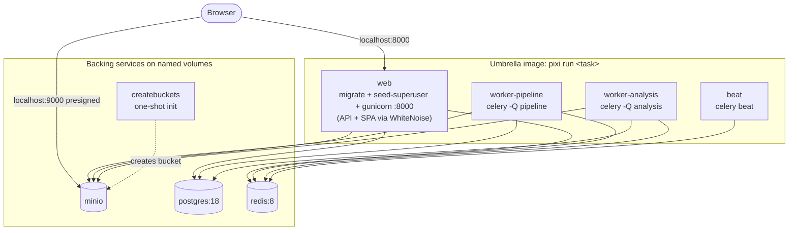
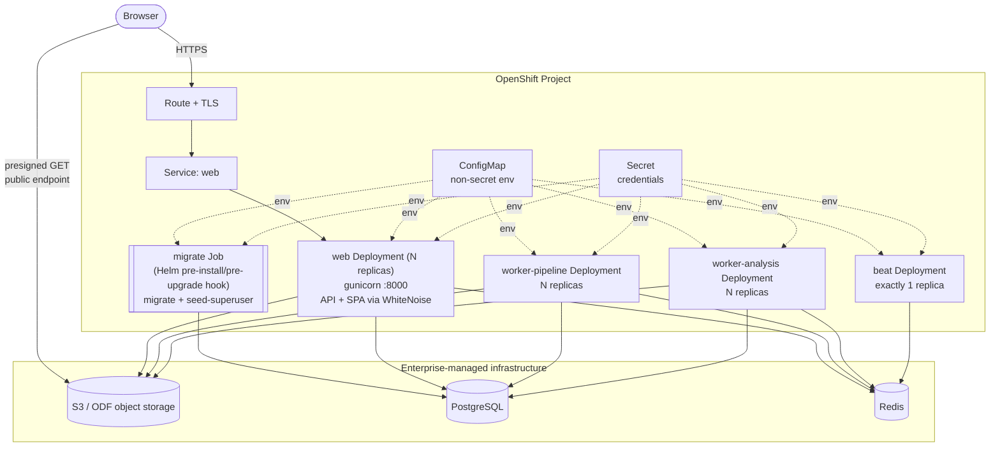
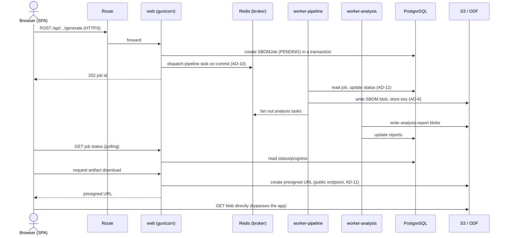

# Architecture: Compose vs OpenShift

This page maps the **current** local topology (Docker Compose) onto the **target**
OpenShift topology. If you have not yet read the [overview](index.md), start there
for the "stateless app in OCP / state on enterprise infrastructure" split and the
glossary.

## Current state: Docker Compose

Locally, `docker-compose.yml` runs eight services on named volumes. All Django and
Celery processes share **one umbrella image** (`Dockerfile`, `FROM
ghcr.io/prefix-dev/pixi`); each service just selects a different `pixi run <task>`
command (`pixi.toml`). The SPA is built into the image and served by the same `web`
process via WhiteNoise — there is **no separate frontend/nginx container**.

Key facts to carry into the migration:

- **`web` startup does three things.** Its Compose command is
  `sh -c "pixi run migrate && pixi run seed-superuser && pixi run web"` — it runs
  database migrations, seeds the initial superuser, then starts gunicorn
  (`config.wsgi`, 4 workers, `:8000`). This is fine with a single local container
  but **races with multiple replicas** in OCP; see
  [migrations as a Job](migration-guide.md#migrations-and-seeding-as-a-job).
- **`beat` is a scheduler singleton.** Celery Beat must run as exactly one instance,
  or scheduled tasks fire multiple times. Its schedule file lives at
  `/tmp/celerybeat-schedule` (`pixi.toml`), a runtime-writable path that matters for
  OpenShift's arbitrary-UID model.
- **`createbuckets`** is a one-shot MinIO init container that creates the artifact
  bucket. With enterprise object storage the bucket is provisioned out-of-band, so
  this service disappears.
- **Presigned downloads bypass the app.** Artifact downloads go straight from the
  browser to object storage via a presigned URL (AD-11), which is why
  `AWS_S3_PUBLIC_ENDPOINT_URL` (browser-reachable) is distinct from
  `AWS_S3_ENDPOINT_URL` (in-cluster/server-side).

## Target state: OpenShift

In OCP the four process types become four **Deployments** from the same image
(built by external CI, pushed to an enterprise registry, pulled by the cluster).
The three backing services are **external** enterprise endpoints reached over the
network. A one-time **Job** runs migrations and seeding per release, replacing the
inline `web` startup steps.

## Component mapping

Every Compose service maps to either an OpenShift object or an enterprise endpoint:

| Compose service | Target | Notes |
|---|---|---|
| `web` | **Deployment** + **Service** + **Route** | Scale to N replicas (stateless). Serves both the REST API and the React SPA/static via WhiteNoise — no nginx sidecar. Liveness/readiness probe → `GET /health/`. |
| `worker-pipeline` | **Deployment** | `celery -Q pipeline`. Scale horizontally. No Service/Route (no inbound traffic). |
| `worker-analysis` | **Deployment** | `celery -Q analysis`. Scale horizontally. No Service/Route. |
| `beat` | **Deployment, `replicas: 1`** | Scheduler singleton — never more than one. Writes `/tmp/celerybeat-schedule`; that path must be writable by the arbitrary UID. |
| `web` startup `migrate` + `seed-superuser` | **Job** (Helm pre-install/pre-upgrade hook) | Runs once per release before the new Pods roll out, avoiding a migration race across replicas. |
| `postgres:18` | **Enterprise PostgreSQL** | External endpoint via `DATABASE_URL`. No in-cluster Pod, no PVC. |
| `redis:8` | **Enterprise Redis** | External endpoint via `REDIS_URL` (broker + result backend + external-API cache). |
| `minio` | **Enterprise S3 / ODF** | External endpoint via `AWS_S3_ENDPOINT_URL`; bucket + credentials provisioned out-of-band. |
| `createbuckets` | **Removed** | Bucket is pre-provisioned by the storage team. |
| named volumes (`postgres-data`, `redis-data`, `minio-data`) | **Removed** | All durability lives in the enterprise services. The app has **no PVCs**. |
| `.env` file | **ConfigMap + Secret** | Split by sensitivity — see the [Reference](reference.md#environment-variables) inventory. |
| optional `flower` task | **Deployment + Route** (optional) | Celery monitoring UI; deploy only if you want it, and protect it — see [observability](reference.md#observability). |

## Request and data flow

Nothing about the application's internal flow changes — only where the boundaries
sit. For a given SBOM generation:

The final step is the load-bearing one for OpenShift networking: the browser
downloads the artifact **directly** from object storage using a presigned URL. That
URL must point at a **browser-reachable** endpoint (`AWS_S3_PUBLIC_ENDPOINT_URL`),
which is generally different from the in-cluster server-side endpoint the app uses
to write blobs. See the [AD-11 note](reference.md#presigned-url-public-endpoint-ad-11)
for the exact variables.
