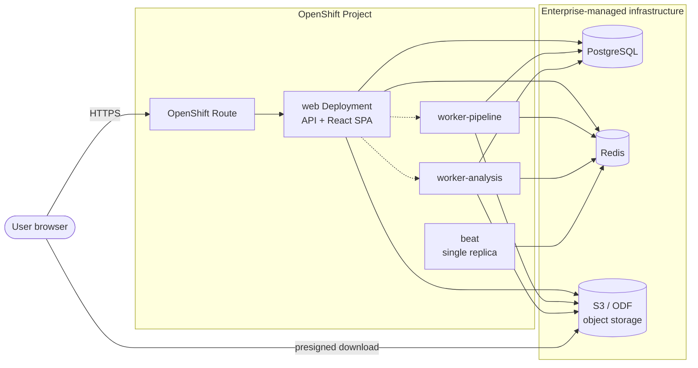

# Deploying to OpenShift

This section explains how to move django-python-generate-sbom from the local
Docker Compose stack (see [Local Development](../../developer/setup.md)) onto the
**Red Hat OpenShift Container Platform (OCP)**. It is written for a first-time
OpenShift deployer: no prior Kubernetes or OpenShift experience is assumed, and
every OCP-specific term is defined in the [glossary](#glossary) below.

Read the pages in order:

1. **This page** — why OpenShift, the "app-in-OCP / state-on-enterprise" split, the
   audience, and the glossary.
2. **[Architecture](architecture.md)** — the current Compose topology versus the
   target OCP topology, with diagrams and a component-mapping table.
3. **[Migration Guide](migration-guide.md)** — prerequisites, image changes,
   secrets, the Helm chart, data migration, and a step-by-step runbook.
4. **[Reference](reference.md)** — the full environment-variable inventory, probes,
   autoscaling, TLS, and observability.

## Why OpenShift

Locally the whole system runs with `docker compose up`: one command starts the
Django/Celery app **and** its backing services (PostgreSQL, Redis, MinIO). That is
perfect for development but not for a shared, resilient, enterprise-operated
environment. OpenShift gives us:

- **Declarative, self-healing deployments** — you describe the desired state
  (replicas, image, resources) and the platform keeps it running, restarting
  crashed pods and rescheduling them onto healthy nodes.
- **Horizontal scale** — the stateless web and worker processes scale to many
  replicas behind a single stable address.
- **Managed ingress and TLS** — an OpenShift **Route** exposes the app on a real
  hostname with a certificate, replacing the local `ports: 8000:8000` mapping.
- **Enterprise guardrails** — role-based access control, network policy, and
  **Security Context Constraints (SCC)** that enforce non-root, least-privilege
  containers.

## The core idea: stateless app in OCP, state on enterprise infrastructure

The most important decision for this migration is **what moves into the cluster and
what does not**:

- The **stateless application** — the four process types (`web`,
  `worker-pipeline`, `worker-analysis`, `beat`) built from the one umbrella image —
  runs **inside OpenShift** as Deployments.
- **All three stateful backing services move OUT** to enterprise-managed
  infrastructure:
    - **PostgreSQL** → an enterprise-managed database (e.g. a managed Postgres
      service or a DBA-operated cluster).
    - **Redis** → an enterprise-managed Redis / cache service.
    - **Object storage** (today MinIO) → enterprise **S3-compatible** storage,
      such as an external S3 endpoint or **OpenShift Data Foundation (ODF)**.

The app reaches all three purely through environment-driven configuration
(connection URLs, bucket name, credentials) — no application code changes are
required to repoint them, because the settings are already read from the
environment (`backend/config/settings/base.py`,
`backend/config/settings/production.py`).

!!! note "Why push state out of the cluster?"
    Databases, brokers, and object stores need durable storage, backups, tuning,
    and careful upgrades. Enterprises usually run these as hardened, separately
    operated services. Keeping the OpenShift workload **stateless** — no
    PersistentVolumeClaims for the app — makes it trivially scalable, restartable,
    and disposable: any pod can be killed and rescheduled with no data loss.

## Audience and scope

This guide is for the engineer performing the first migration. It assumes you can:

- run `oc` (the OpenShift CLI) against a cluster and have a Project to deploy into;
- read Kubernetes-style YAML;
- coordinate with whoever operates the enterprise PostgreSQL, Redis, and object
  storage.

It does **not** cover provisioning the enterprise backing services themselves
(that is the platform/DBA team's job) or cluster administration. It documents the
**app side**: the image, the Helm chart, the configuration, and the data
migration.

!!! warning "Documentation only"
    Everything here is reference material. The manifest, `Dockerfile`, and Helm
    snippets on these pages are **illustrative** — they are not committed to the
    repository as working infrastructure. Treat them as a starting point to adapt
    to your cluster's conventions.

## Glossary

New to OpenShift and Kubernetes? These are the terms used throughout this section.

| Term | What it means here |
|---|---|
| **OCP / OpenShift** | Red Hat OpenShift Container Platform — an enterprise Kubernetes distribution. |
| **Project / Namespace** | A Project is OpenShift's wrapper around a Kubernetes **Namespace**: an isolated slice of the cluster where this app's objects live. |
| **Pod** | The smallest deployable unit — one or more containers scheduled together. Each app replica is a Pod. |
| **Deployment** | A controller that keeps a declared number of identical Pods running from a given image. Each of our four process types is one Deployment. |
| **Service** | A stable in-cluster virtual IP + DNS name that load-balances to a Deployment's Pods. Other Pods reach `web` through its Service. |
| **Route** | OpenShift's ingress object — exposes a Service on a public hostname, terminating TLS. This is what replaces the local `8000:8000` port mapping. |
| **Job** | A run-to-completion workload (as opposed to a long-running Deployment). Used here to run database migrations once per release. |
| **ConfigMap** | Holds non-secret configuration as key/value pairs, injected into Pods as environment variables. |
| **Secret** | Like a ConfigMap but for sensitive values (passwords, keys). Stored base64-encoded and access-controlled. |
| **SCC (Security Context Constraint)** | An OpenShift policy controlling what a Pod may do — which UID it runs as, whether it can be root, etc. The default `restricted-v2` SCC runs containers as a **random non-root UID**. |
| **PVC (PersistentVolumeClaim)** | A request for durable disk. Our app needs **none** — all state is external. |
| **Helm** | A package manager for Kubernetes. A **chart** is a templated bundle of manifests plus a `values.yaml` for per-environment settings. |
| **Registry** | Where container images are stored and pulled from (e.g. **Quay**, an enterprise registry). OCP pulls the app image from here. |
| **ImageStream** | An OpenShift object that tracks tags in a registry; optional here since images are built and pushed by external CI. |
| **Pull secret** | A Secret holding registry credentials so OCP can pull a private image. |
| **HPA (HorizontalPodAutoscaler)** | Automatically scales a Deployment's replica count based on CPU/memory load. |
| **S2I (Source-to-Image)** | An OpenShift feature that builds an image from source **inside** the cluster. We deliberately **do not** use it — images are built by external CI. |
| **ODF (OpenShift Data Foundation)** | Red Hat's software-defined storage; can provide an in-cluster S3-compatible object store as an alternative external endpoint. |
| **Arbitrary UID** | The consequence of `restricted-v2`: the container process runs as an unpredictable high-numbered UID in group `0` (root group), so the image must not assume it runs as a fixed user. |
