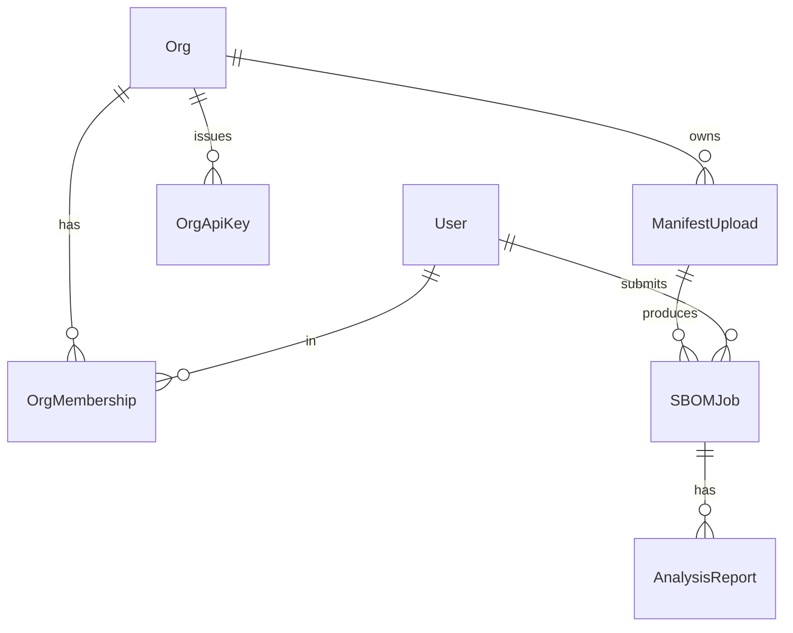

# Data Model

The core relational models live across the Django apps. Tenant-scoped models inherit
from `OrgScopedModel` (AD-2), which carries the owning `Org` and enforces org
filtering.

## Accounts & tenancy (`users/`)

| Model | Purpose |
|---|---|
| `User` | Custom user (`AbstractUser` subclass) |
| `Org` | A tenant/organization |
| `OrgMembership` | User ↔ Org link with a `Role` (owner/admin/member) |
| `OrgApiKey` | Per-org API key, an `AbstractAPIKey` subclass (AD-8) |

`Org` is the tenancy boundary: every scoped record belongs to exactly one org, and
requests act within the caller's active org.

## Manifests (`manifests/`)

| Model | Purpose |
|---|---|
| `ManifestUpload` | An uploaded dependency manifest (org-scoped) with a detected `Format` |

`Format` is a `TextChoices` covering the supported inputs (e.g. `requirements`,
`pyproject`, pixi and conda lockfiles). The concrete parsers live in
`sbom/parsers/`.

## Jobs (`sbom/`)

`SBOMJob` (org-scoped) is the heart of the system — one row per generation run.

| Field | Notes |
|---|---|
| `task_id` | UUID primary key; also the Celery task id |
| `manifest` | FK → `ManifestUpload` |
| `user` | FK → the submitting user |
| `status` | `PENDING → PROGRESS → SUCCESS`/`FAILED` — **written only by task code** (AD-12) |
| `progress` / `current_step` | Live progress for SPA polling |
| `output_format` | Internal serializer id for the SBOM |
| `result_key` | Storage key of the generated SBOM blob (not the blob itself, AD-6) |
| `summary_stats` | JSON roll-up for the results overview |
| `created_at` / `completed_at` | Timestamps |
| `artifacts_expire_at` | Drives scheduled artifact expiry |
| `failure_reason` | Set by the phase guard on failure |

## Analysis (`analysis/`)

| Model | Purpose |
|---|---|
| `AnalysisReport` | One enrichment result for a job |

Each report has a `report_type` (`vuln`, `license`, `graph`, `version`), an optional
`artifact_key` (blob in storage), and a JSON `summary`. A job has up to four reports —
one per analysis phase.

## Relationships

