# Inventory App Reference

A file-by-file tour of **`src/django_apps/inventory/`** — the single reusable Django app
that holds all of this project's domain behaviour.

Where [Architecture](architecture.md) explains *why* the system is shaped as it is and
[Project Layout](project-layout.md) says *where* things live, this page says **what each
file does**, what invariant it carries, and which of its neighbours it may talk to. It is
written for someone about to change one of these files.

!!! note "Scope"
    The focus is `src/django_apps/inventory/`. The host halves of the tree —
    `src/config/` (Django project configuration) and `src/django_service/` (the host
    project: the concrete `User`, the page shell, static assets) — are covered in
    [The host side](#13-the-host-side) at the end, because they are what *mounts* the app
    rather than what the app is.

---

## 1. The app in one picture

`inventory` is a **modular monolith inside a single Django app label**. Story 21.2
collapsed four app labels (`users`, `manifests`, `sbom`, `analysis`) into one; those
former apps survive as plain Python subpackages. Only `inventory` is in
`INSTALLED_APPS`, and it is imported **unqualified** — `from inventory.sbom import
services`, never `django_apps.inventory.sbom` — because `src/django_apps/` is a path
root, not a package (it deliberately carries no `__init__.py`).

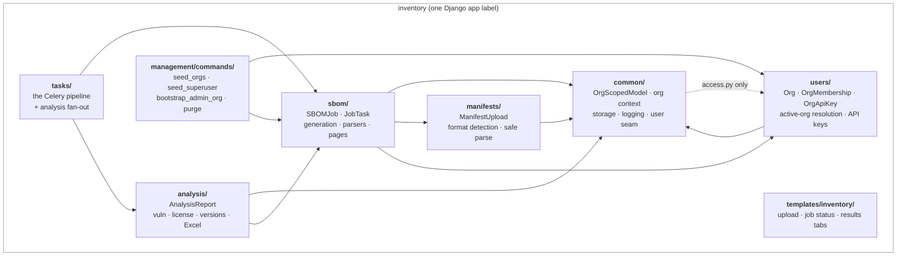

**The dependency direction is one-way (AD-1).** `common` is the base; `users` and
`manifests` sit above it; `sbom` may import `manifests` and `users`; `analysis` may
import `sbom`; `tasks` sits on top and imports everything. An import that runs the other
way is a design error, not a convenience — `sbom` never imports `analysis`, which is why
the pipeline's chord callback lives in `tasks/`.

The one dotted edge is `common/access.py` reaching back into `inventory.users.auth`.
That is deliberate rather than accidental: `get_request_org` must have exactly one
implementation, and a second resolver living in `common` would be free to drift from it.

### The file-role convention

Every subpackage uses the same filenames for the same jobs. This is the single most
useful thing to know when navigating the tree:

| File | Role |
| --- | --- |
| `models.py` | ORM declarations only — no behaviour beyond `__str__` and trivial properties |
| `selectors.py` | **Read-only** queries. Plain arguments in, querysets/dataclasses out |
| `services.py` | **Mutations** and domain rules. The behaviour lives here (AD-3) |
| `views.py` | **DRF** views — JSON, mounted under `/api/v1/` |
| `pages.py` | **Django** views — server-rendered HTML, mounted at the site root |
| `serializers.py` | DRF request/response schemas |
| `forms.py` | Django forms for the HTML pages |
| `tables.py` / `filters.py` | django-tables2 / django-filter definitions for the pages |
| `urls.py` | The subpackage's **API** urlconf |

**Pages and API views are peers, never layered.** A page view calls `services.py`
directly; it never issues an HTTP request to its own API (AD-15). That is what keeps the
two entry points from drifting while allowing them to differ where they should — the
pages are cross-org since Story 22.16, the API stays org-scoped because an API key pins
one tenant.

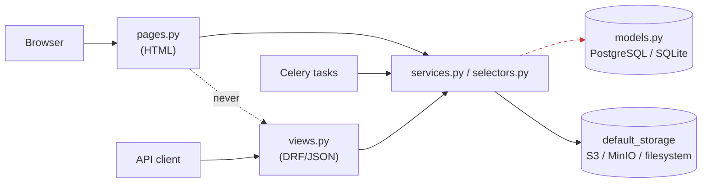

---

## 2. App wiring

These four files at the app root are what Django itself loads.

### `__init__.py`

Package docstring and `__version__`. Nothing imports at app-load time here, deliberately —
a side effect at this level would run before the app registry is populated.

### `apps.py` — `InventoryConfig`

Declares `name = "inventory"` (the **unqualified** import path) and `label = "inventory"`
explicitly. `ready()` imports `.users.schema` purely for its registration side effect, so
drf-spectacular learns about the custom API-key auth scheme at startup.

### `models.py` — the model registry

Django populates the app registry by importing exactly **one** module per app:
`<app>.models`. The models themselves live in their domain subpackages, so this module
exists to re-export them:

```python
from inventory.analysis.models import AnalysisReport
from inventory.common.models import OrgScopedManager, OrgScopedModel, OrgScopedQuerySet
from inventory.manifests.models import ManifestUpload
from inventory.sbom.models import JobTask, SBOMJob
from inventory.users.models import Org, OrgApiKey, OrgApiKeyManager, OrgMembership
```

!!! danger "The trap"
    A model added to a subpackage but **not** re-exported here is never imported by
    Django and therefore silently does not exist — no table, no migration, no error.

### `urls_pages.py` — the server-rendered urlconf

Mounted at the **site root** by `config/urls.py`, separate from the per-subpackage
`urls.py` files, which are the DRF urlconfs under `/api/v1/`.

**Every route name is prefixed `ui-`, and that is load-bearing.** The API urlconfs
already own the obvious names (`sbom-jobs`, `key-list`, …), and Django resolves a
duplicate `name=` to whichever pattern is registered *last* — which is the API, because
`config/urls.py` includes it afterwards. In Story 21.4 that silently pointed an HTML form
at a JSON endpoint.

| Path | Name | View |
| --- | --- | --- |
| `keys` / `keys/create` / `keys/revoke` | `ui-keys`, `ui-key-create`, `ui-key-revoke` | `users.pages` |
| `upload` | `ui-upload` | `UploadPageView` |
| `job-status` | `ui-job-status` | `JobStatusView` |
| `job-status/records/delete[-all]` | `ui-jobs-delete-records`, `ui-jobs-delete-all-records` | record deletes |
| `job-status/row/<uuid>` | `ui-job-row` | polled row partial |
| `job-status/manifest/<uuid>` | `ui-job-manifest` | uploaded manifest viewer |
| `results/<uuid>` | `ui-job-results` | results shell |
| `results/<uuid>/progress` | `ui-job-progress` | polled progress fragment |
| `results/<uuid>/tab/<str>` | `ui-job-tab` | one tab panel |
| `results/<uuid>/sbom/raw` | `ui-job-sbom-raw` | raw document, on demand |
| `results/<uuid>/sbom/download` | `ui-job-sbom-download` | 303 to presigned URL |
| `results/<uuid>/export/<kind>.xlsx`, `export.xlsx` | `ui-job-export`, `ui-job-export-all` | Excel exports |

---

## 3. `common/` — shared abstractions

The bottom layer: everything here is imported by the rest of the app. `models.py`,
`users.py`, `storage.py`, and `logging.py` import nothing from `inventory` at all.
`access.py` is the one exception — it reaches into `inventory.users.auth` deliberately,
because there must be exactly **one** active-org resolver and a second one here would be
free to drift from it.

### `models.py` — org scoping (AD-2)

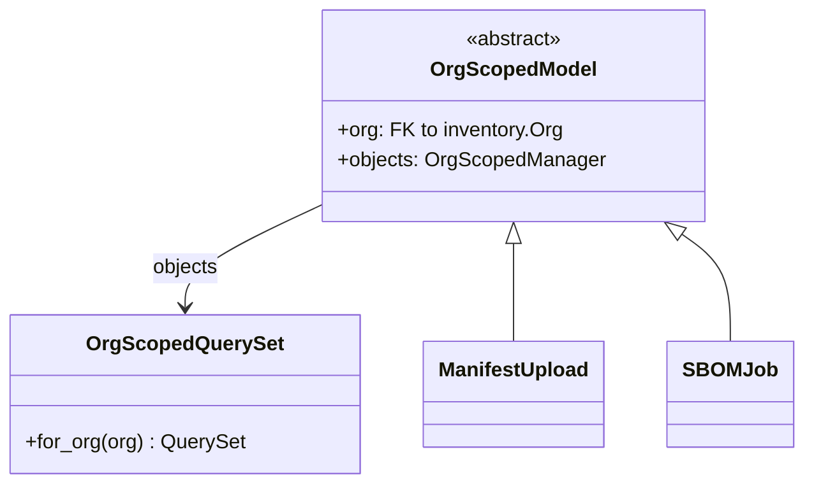

`OrgScopedModel` gives a model an `org` FK plus a manager exposing `.for_org(org)`.
**This is where tenant isolation is actually enforced** — filtering happens *inside the
query*, so "belongs to another org" and "does not exist" are the same miss by
construction. There is no post-hoc check to forget.

### `access.py` — `OrgContextMixin`

Resolves the acting org onto `self.org` before a page view's body runs. **It is not a
gate.** Story 21.24 removed the app's own authentication outright; the three mixins that
used to live here (`OrgMemberRequiredMixin`, `OrgAdminRequiredMixin`,
`GlobalAdminRequiredMixin`) were *deleted*, not disabled.

When the database contains no organisation at all, `dispatch` short-circuits to a shared
`_no_orgs.html` page at 200 rather than raising — so `self.org` is a plain `Org` for
every view body and nineteen view classes do not each need a `None` branch.

The module docstring is worth reading in full: it records that a previous
`get_org_scoped_object_or_404` helper was removed because it had **zero callers** while
being documented as the security boundary. A function that looks like the boundary and
enforces nothing is worse than no function.

### `users.py` — the host-user seam

The app's **only** contact point with the host project's `User`. `inventory` must never
import the concrete class:

| Need | Use |
| --- | --- |
| Model FK | `settings.AUTH_USER_MODEL` (a swappable string, resolved lazily) |
| Type annotation | `UserT` (= `AbstractUser`, deliberately *not* the host's class) |
| Runtime lookup | `user_model()` |
| Creation | `create_user()` / `create_superuser()` |
| ORM field value or filter argument | `user_ref()` |

`user_ref()` looks like a no-op and is not one: the django-stubs mypy plugin reads
`AUTH_USER_MODEL` from settings and types every FK declared against it as the *concrete*
class, so handing it a `UserT` is an error — correctly, because a different host would
have a different class. `user_ref` states "this type is genuinely unknown from inside the
app" at the ~20 sites where that is true, instead of scattering per-line ignores.

`tests/unit/test_app_user_decoupling.py` enforces the no-import rule.

### `storage.py` — `PublicEndpointS3Storage`

Subclasses django-storages' `S3Storage` so presigned download URLs (AD-11) get their host
rewritten from the internal endpoint (`http://minio:9000`, used for server-side I/O) to
`AWS_S3_PUBLIC_ENDPOINT_URL` — which is what a user's browser can actually reach. Safe
because the host is not part of a SigV2 signature.

### `logging.py` — `configure_structlog`

Process-wide structlog configuration: JSON renderer in production, console renderer
locally. Called from the settings modules. `print()` and stdlib `logging` are never used
for application output (NFR-5.3).

### `views.py`, `urls.py`, `config_views.py`

- `views.health` — unauthenticated liveness check. Deliberately touches no database, so
  it reports healthy independent of migration timing; it exists to gate Compose
  `depends_on` ordering.
- `config_views.AppConfigView` — `GET /api/v1/config/`, a public feature-flag payload
  (`{"api_docs_enabled": …}`), so a client link can never point at a disabled endpoint.
- `urls.py` — mounts `config/` under `/api/v1/`.

---

## 4. `users/` — tenancy, membership, and API keys

### The data model

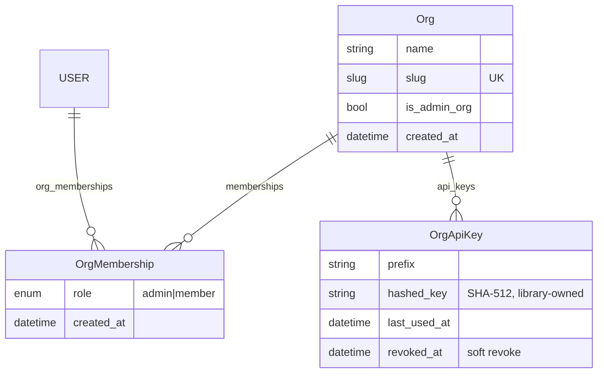

`Org` is the tenant root and is **not** itself org-scoped. Exactly one org carries
`is_admin_org=True` — the **ADMIN org**, whose members are *global admins*. That tier is
provisioned as a real ADMIN membership into every other org, existing and future, so it
bypasses isolation by having genuine memberships rather than by a special case in the
query layer.

### `auth.py` — active-org resolution (the single source of truth)

`get_request_org(request)` is the one function that answers "which org is this request
acting as?", for pages, API views, and the navigation context processor alike. Three
paths, in order:

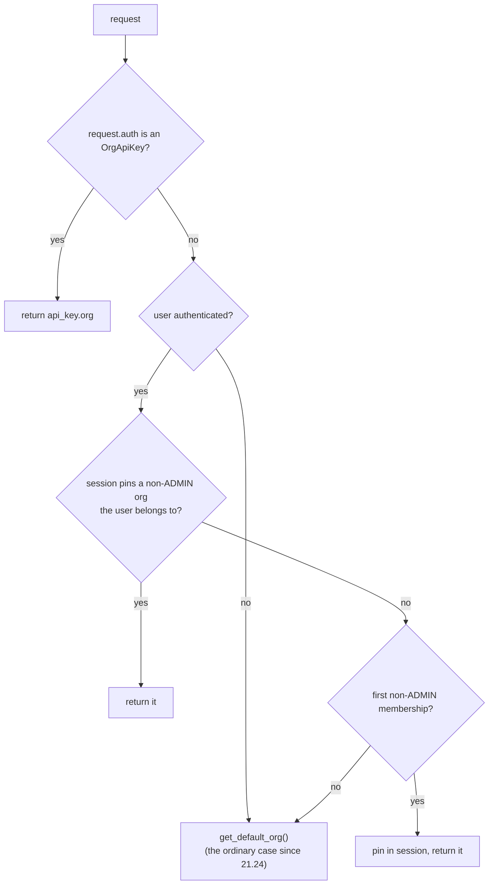

Also here: `set_active_org_by_slug` (refuses the ADMIN org — it is a meta org, not a
workspace) and `get_admin_org`, which since Story 21.24 returns the same answer as
`get_request_org`. It is kept as a distinct function **because it marks where an
authorization decision belongs**; Epics 17–18 reintroduce that decision from
host-supplied group claims, and this is the seam it goes back into.

### `authentication.py` — `OrgApiKeyAuthentication`

Resolves `Authorization: Api-Key <key>` to an `OrgApiKey` via
`djangorestframework-api-key` (SHA-512, no hand-rolled crypto, AD-8), rejects revoked
keys, stamps `last_used_at`, and exposes `request.auth.org`. Returns `None` — deferring to
session auth — when the header is absent.

### `selectors.py` (read-only)

| Function | Returns |
| --- | --- |
| `get_default_org()` | The org an anonymous caller acts as: the `INVENTORY_DEFAULT_ORG_SLUG` org (seeded by migration `0003`), else the first non-ADMIN org by name. **Never the ADMIN org.** |
| `get_switchable_orgs(user=None)` | Every non-ADMIN org by name. The `user` argument is accepted and ignored — it is the seam an OIDC identity would use to narrow this again |
| `get_org_members(org)` | Memberships with users, by email |
| `get_api_keys(org)` | Active (non-revoked) keys, newest first |

### `services.py` — membership and key mutations

The largest service module in the app. It owns the org/membership invariants and raises a
typed `MembershipError` subclass for each, which both the API and the pages translate
into their own idiom (a JSON `{error, code}` envelope, or a form error).

| Exception | `code` | Rule it protects |
| --- | --- | --- |
| `LastAdminError` | `last_admin` | An org must always keep ≥1 admin |
| `AdminOrgProtectedError` | `admin_org_protected` | The ADMIN org must never lose its last global admin |
| `GlobalAdminError` | `global_admin_protected` | A global admin belongs to *every* org and cannot be removed from one |
| `LastGlobalAdminError` | `last_global_admin` | The global-admin tier must never be emptied |
| `AlreadyMemberError` / `NotAMemberError` | … | Membership presence |
| `NoSuchUserError` / `EmailTakenError` | … | Add-existing vs create-new, kept distinct |
| `ApiKeyLimitError` | `api_key_limit_reached` | 10 active keys per org (FR-2.2) |

`_guard_membership_removal` applies rules 1–3 in priority order and is shared by
`remove_member` and `leave_org`, so "removed by an admin" and "left voluntarily" cannot
diverge.

`create_api_key(org, name)` returns `(OrgApiKey, plaintext)`; the plaintext is returned
**once** and never stored — only a hash exists (AD-8, NFR-3.3). `revoke_api_key` is a
soft revoke (`revoked_at`) scoped to the org, so a wrong-org key and a nonexistent key are
the same code path and the same message.

`create_org(name, admin_user=None)` takes an *optional* admin because the ordinary caller
is now anonymous. An org with no memberships is a coherent state here — the same shape
`ManifestUpload.user` and `SBOMJob.user` already use for API-key work. A synthetic user is
deliberately not invented.

### `views.py` — the accounts API surface

Fifteen `APIView` classes behind `/api/v1/`, all thin: resolve the org, validate a
serializer, call a service, map `MembershipError` to a 400 envelope. Endpoints cover
`auth/me/`, org list/create/switch/me/leave, member roster and promote/demote, API keys,
and global-admin grant/revoke.

Two module constants are worth noting. `_NOT_ADMIN` is still returned — but only when the
deployment has *no organization at all*, since `get_admin_org` is now `get_request_org`;
its wording is stale and deliberately left alone for Epics 17–18 to restore. There is
deliberately **no** global-admin refusal constant: keeping one "for the schema" made it
read as though a code path might still refuse, and a test pins that its error code appears
nowhere in `src/`.

### `serializers.py`

Request serializers (`RegistrationSerializer`, `CreateKeySerializer`, …) plus a block of
**response serializers used only for schema documentation** — the views build their dicts
directly, so these carry no `create`/`update`. They exist so the generated OpenAPI schema
exposes accurate response shapes.

### `pages.py`, `forms.py` — the HTML side

`ApiKeysView` (list), `ApiKeyCreateView`, `ApiKeyRevokeView`, plus `CreateApiKeyForm`.

The create view **renders** the plaintext on the POST response and never redirects to it:
only a hash is stored, so a key not captured now is permanently unrecoverable, and
stashing the plaintext in the session to survive a redirect would put a live credential in
the session store. The story calls that a correctness constraint, not polish.

### `schema.py`

A `OpenApiAuthenticationExtension` describing `OrgApiKeyAuthentication` as an `apiKey`
header scheme, since drf-spectacular cannot introspect a custom `BaseAuthentication`.
Registered from `InventoryConfig.ready()`.

---

## 5. `manifests/` — upload, detect, validate

### `models.py` — `ManifestUpload`

Org-scoped, UUID primary key, nullable `user` (API-key uploads have an org but no user).
Stores the file plus the four **provenance** fields FR-3.8 requires — `application_id`,
`component_name`, `repository_url`, `source_branch` — which are later embedded in the
generated SBOM's document metadata. `manifest_upload_path()` keys storage as
`manifest-uploads/{org_id}/{upload_id}/{filename}` (NFR-1.2: storage paths are org-scoped).

### `detection.py` — format detection and safe parsing

Detection is **by filename**, with an optional explicit override, using a regex per format
that allows a prefix and/or suffix around a distinctive core token:

| Pattern | Format | Matches |
| --- | --- | --- |
| `requirements[\w.-]*\.txt$` | `requirements` | `requirements.txt`, `dev-requirements.txt`, `requirements-test.txt` |
| `pyproject[\w.-]*\.toml$` | `pyproject` | `pyproject.toml`, `backend-pyproject.toml` |
| `pixi[\w.-]*\.toml$` | `pixi_toml` | `pixi.toml`, `pixi-prod.toml` |
| `pixi[\w.-]*\.lock$` | `pixi_lock` | `pixi.lock` |
| `environment[\w.-]*\.ya?ml$` | `conda` | `environment.yml`, `dev-environment.yaml` |

`validate_parseable()` then parses the content with **safe loaders only** — `tomllib`,
`yaml.safe_load` — never `eval`/`exec`/shell (NFR-3.1). `requirements.txt` has no
structured grammar to validate beyond decoding.

Raises `UnsupportedFormatError` or `ManifestParseError`; callers map both to 400.

### `services.py` — `upload_manifest`

Strips directory components from the uploaded name (`PurePosixPath(...).name`, after
normalising backslashes) to prevent path traversal (NFR-3.4), detects the format,
validates it, stores the file through the configured default storage, and records the
provenance. Logs `manifest_uploaded` with org, upload id, and format.

### `serializers.py`, `views.py`, `urls.py`

`ManifestUploadSerializer` enforces the **50 MB cap** (`MAX_MANIFEST_BYTES`, FR-3.4) —
this constant is the *one* definition of the limit, imported by the SBOM upload form so
the HTML and API entry points cannot drift. `ManifestUploadView` is
`POST /api/v1/manifests/upload/`, returning `{upload_id, detected_format}`.

---

## 6. `sbom/` — jobs, generation, and the primary UI

The biggest subpackage. It owns the `SBOMJob` lifecycle, manifest→package resolution, SBOM
document serialization, and the entire server-rendered results experience.

### `models.py` — `SBOMJob` and `JobTask`

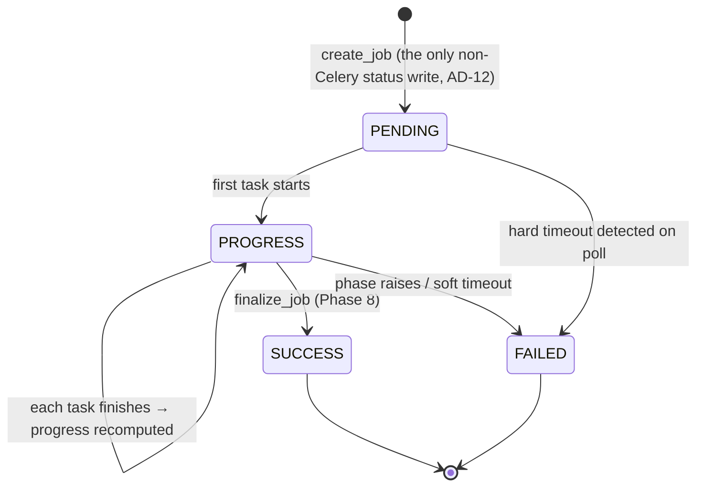

`SBOMJob` is org-scoped with a UUID `task_id` primary key. `status` is written **only**
through `services.py` (AD-12). `result_key` holds the storage key of the generated
document — nulled, not deleted, when artifacts are purged, which is how the UI knows to
say "artifacts removed" instead of appearing broken. `summary_stats` is a JSON column
holding the package count plus each analysis report's summary, so the Overview tab renders
without fetching four artifacts (NFR-2.2).

`JobTask` is **one row per pipeline task per job**, added by Story 22.20:

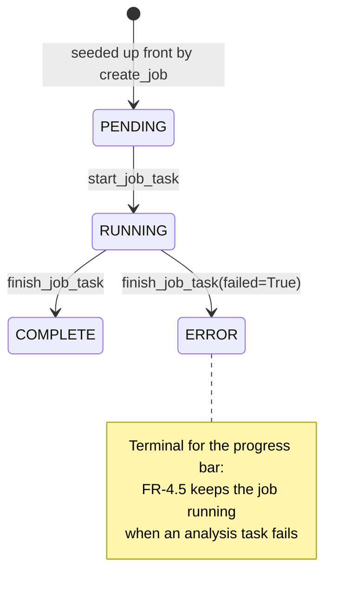

A table rather than a JSON blob on the job, because the three analysis tasks run
*concurrently*: each writes only its own row, so there is no read-modify-write to race on
— and the UI can show two tasks running at once, which a single `current_step` string
cannot express.

### `pipeline_tasks.py` — the pipeline's shape, declared once

```python
PIPELINE_TASKS = (
    PipelineTask("detect",    "Detect & parse manifest", 1),
    PipelineTask("resolve",   "Resolve dependencies",    2),
    PipelineTask("generate",  "Generate SBOM document",  3),
    PipelineTask("vuln",      "Vulnerability scan",      4),
    PipelineTask("license",   "License compliance",      5),
    PipelineTask("version",   "Version currency",        6),
    PipelineTask("aggregate", "Aggregate analysis",      7),
    PipelineTask("persist",   "Persist artifacts",       8),
)
```

`progress_for(finished)` derives the bar percentage from how many rows are terminal —
each task worth an equal share, clamped. This replaced hand-picked percentages
(5, 20, 45, 55, 80, 93, 95, 97) that drifted and *collided*: two different phases both
claimed 93%, so the bar and the label disagreed.

`ordinal` is **display order only**, not execution order — `vuln`, `license`, and
`version` run concurrently in a chord.

### `services.py` — the mutation layer

The module `__all__` is the app's most-used API. Highlights:

**`submit_job(org, user, *, file_obj, …, output_format)`** — the whole submission
sequence in one place, shared by the DRF endpoint and the upload page:

1. **AD-7** — the per-org concurrency gate (`at_concurrency_limit`) is checked before
   anything is written.
2. **AD-12** — `create_job` performs the sole permitted non-Celery write of `PENDING`,
   and seeds the eight `JobTask` rows.
3. **AD-10** — dispatch is `run_sbom_pipeline.delay_on_commit(...)`, so a worker can
   never observe a job row the surrounding transaction has not committed.

**Progress writers.** `start_job_task` / `finish_job_task` write one task's row and then
call `_sync_job_progress`, which recomputes `SBOMJob.progress` by counting terminal rows.
Both are wrapped in `_reporting_is_best_effort` — a deliberately broad
log-and-continue guard. That exists because `start_job_task` is called from the phase
guard *before* its `try`, so anything it raised propagated out of the context manager's
entry and skipped every failure path: the phase died, the job was never marked FAILED, and
it sat at PENDING showing "Queued". **Telemetry is not the work.**

**Status writers.** `update_job_status` defaults `progress` and `current_step` to `None`
meaning *leave alone*, not `0`/`""` meaning reset — the old defaults quietly wiped both,
so a job that failed at 62% on version currency displayed as 0% with no phase.
`finalize_job` marks SUCCESS, stamps `completed_at`, and sets
`artifacts_expire_at = now + ARTIFACT_RETENTION_DAYS`.

**Deletion, in two distinct flavours:**

| Function | What goes | What stays |
| --- | --- | --- |
| `delete_job_artifacts(job)` | SBOM + report blobs; `result_key`/`artifact_key` nulled | The job record and all metadata (FR-8.1) |
| `delete_job_record(job)` | Every blob, the `SBOMJob` row, cascaded `JobTask`/`AnalysisReport` rows, and the `ManifestUpload` once no other job needs it | Nothing |

`delete_job_record` deletes **blobs first, row last**: a job row with a missing blob is a
state the app already handles, whereas a deleted row pointing at surviving blobs would
leave storage with nothing left to name it.

**Other primitives:** `presigned_artifact_url` (24 h TTL, one implementation for the API's
303 and the page's download button, with a `TypeError` fallback for `FileSystemStorage`,
which has no presigning); `mark_stale_job_timed_out` (a hard timeout force-kills the
worker, so the *poll* detects it — FR-4.6); `build_provenance` (takes the organization
from the **manifest's** org, not the acting request, so a regenerated or later-exported
SBOM still names the line of business it was filed against); `resolve_job_packages`;
`purge_expired_artifacts`.

**Output formats** are declared once:

```python
OUTPUT_FORMAT_MAP = {"cdx-json": "cyclonedx-json", "cdx-xml": "cyclonedx-xml", "spdx-2.3": "spdx-json"}
OUTPUT_FORMAT_CHOICES = tuple((v, OUTPUT_FORMAT_LABELS[v]) for v in OUTPUT_FORMAT_MAP)
```

Story 6.4 was caused by the frontend and backend keeping separate format lists that
drifted; a test fails if a format is added to the map without a label.

### `selectors.py` — read-only queries

| Function | Scope | Used by |
| --- | --- | --- |
| `get_job(org, task_id)` | **Org-scoped** — raises `DoesNotExist` → 404 | The API |
| `get_any_job(task_id)` | **Cross-org** | The pages (Story 22.16) |
| `get_jobs(org, …)` | Org-scoped list | The API |
| `get_all_jobs(…)` | Cross-org list, `select_related("manifest", "org")` | Job Status page |
| `get_job_by_task_id(task_id)` | Unscoped | Task code (org was established at submission) |
| `read_inline_document(job)` | — | Both, for the in-page viewer |

The cross-org split is deliberate and documented: since Story 21.24 anyone could already
reach any org's jobs by switching to it, so listing across orgs makes that honest rather
than adding exposure. The **API** keeps the scoped selector because an API key genuinely
pins one tenant (AD-8).

`STATUS_FILTERS` maps UI labels ("In Progress", "Completed", "Failed") to status values
and is shared by the API filter and the page's FilterSet, so the two cannot disagree about
what "In Progress" means. `_apply_job_filters` degrades an unrecognised format filter to
an **empty page**, never an error — Story 6.4 was a bug where a filter selection produced
an error banner instead of rows.

`read_inline_document` returns an `InlineDocument` dataclass (`output_format`, `metadata`,
`components`, `raw`) or `None`. "Unavailable" covers never-produced, not-finished, and
purged alike, because the viewer's response is the same in all three cases: a notice, not
an error.

### `parsers/` — manifest → resolved package list

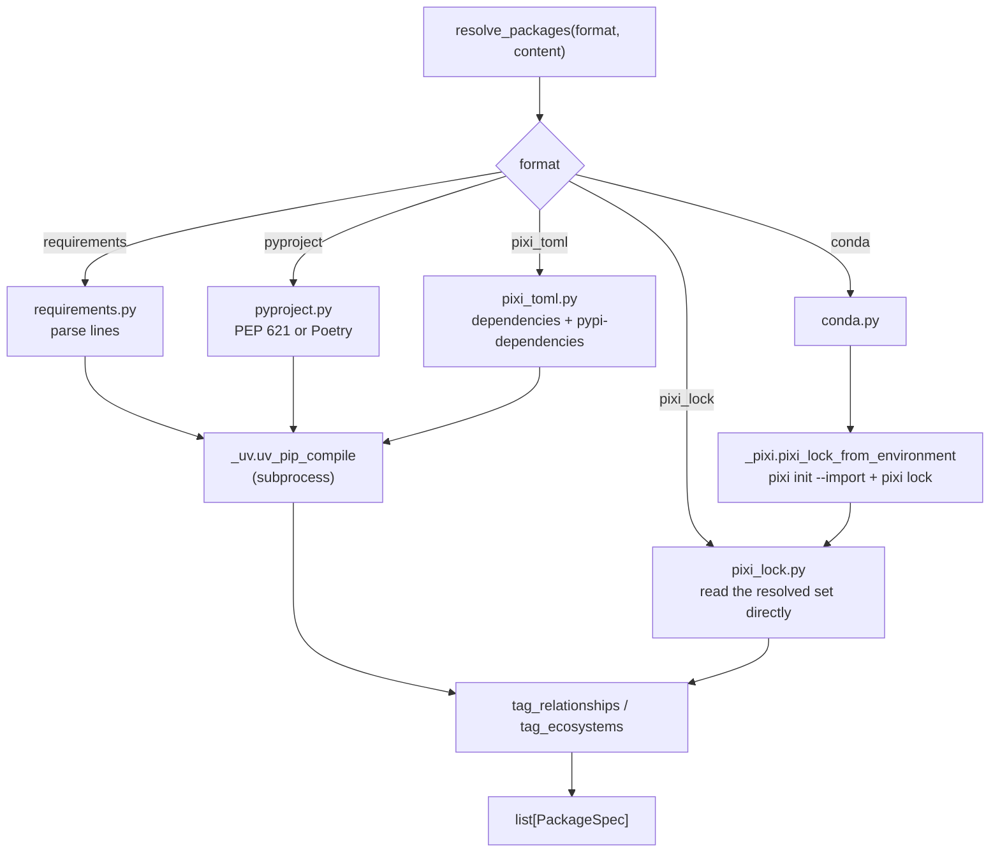

- **`_types.py`** — the `PackageSpec` frozen dataclass (`name`, `version`, `extras`,
  `markers`, `relationship`, `ecosystem`), the `direct`/`transitive`/`unknown` and
  `pypi`/`conda` constants, `ResolutionError`, and the three tagging helpers.
  `tag_relationships` intersects the resolved set with the *declared* set by PEP 503
  canonical name (AD-14) — declared wins for a package that is both.
- **`__init__.py`** — the `_RESOLVERS` dispatch table keyed by `ManifestUpload.Format`,
  and the public re-exports.
- **`requirements.py`** — strips comments, rejects a malformed line via
  `packaging.requirements.Requirement`, records the declared names, then compiles.
- **`pyproject.py`** — PEP 621 `project.dependencies` first, falling back to Poetry's
  `tool.poetry.dependencies` (dropping `python`).
- **`pixi_toml.py`** — names from `dependencies` (conda) and `pypi-dependencies`;
  resolution flattens via uv, then conda-declared names are tagged `conda`.
- **`pixi_lock.py`** — reads the **fully resolved** set with no external resolver. It is
  YAML, not TOML. Modern (v7) conda entries carry no explicit name/version, so those are
  recovered from the `conda:` URL filename (`<name>-<version>-<build>`, rsplit on `-`
  twice because names may contain hyphens).
- **`conda.py` + `_pixi.py`** — an `environment.yml` is imported into a pixi workspace
  (`pixi init --import`) and solved with `pixi lock`, rather than shelling out to
  conda/mamba; the resulting lock is then parsed by `pixi_lock`. Pinned to **linux-64**
  with a `cuda = "12"` system requirement so linux-only and CUDA builds resolve regardless
  of the worker's own architecture. `pixi init --import` silently drops specs it cannot
  convert, so `_assert_all_declared_present` fails loudly instead of producing a silently
  incomplete SBOM. `_clean_env()` strips `PIXI_*`/`CONDA_*` from the environment, or the
  nested `pixi` would be redirected at the application's own manifest.
- **`_uv.py`** — the `uv pip compile` wrapper. **Receives file paths only, never file
  content as shell arguments.** 300 s timeout; `parse_compiled` reads the pinned
  `name==version` output back into `PackageSpec`s.

### `generation.py` — SBOM serialization (Phase 3)

Pure and I/O-free: packages + provenance + a resolved license map in, serialized bytes
out. Format selection alone picks the serializer.

| `output_format` | Library | Extension |
| --- | --- | --- |
| `cyclonedx-json` | `cyclonedx-python-lib` (CycloneDX 1.6) | `json` |
| `cyclonedx-xml` | `cyclonedx-python-lib` (CycloneDX 1.6) | `xml` |
| `spdx-json` | `lib4sbom` (SPDX 2.3) | `json` |

The `Provenance` dataclass carries the four FR-3.8 fields plus `organization`. The
organization is emitted as each format's **supplier** — CycloneDX `metadata.supplier`,
SPDX `PackageSupplier` — rather than as a custom property, because those are fields other
SBOM tooling already reads. It defaults to empty: SBOM generation is a hard-fail phase, and
losing the whole document over a blank metadata field would be the worse outcome.

Per component the serializers emit a `purl`, a `sbom:relationship` property, a
`package:ecosystem` property, and the resolved license (SPDX id, expression, or free text;
omitted entirely when unknown). The root component depends on its direct dependencies —
falling back to *all* components when none are identified (e.g. `pixi.lock`), rather than
asserting a false split. `_order_metadata_before_components` reorders CycloneDX JSON so
`metadata` leads, which the library does not do.

Any library-level failure becomes `SBOMGenerationError` — the FR-4.5 hard-fail boundary.

### `document.py` — reading a stored SBOM back

The inverse of `generation.py`, and equally pure. `normalize_components(raw, format)`
returns a flat list of `{name, version, type, purl, license, relationship, ecosystem}`
dicts; `parse_metadata(raw, format)` recovers the document header. Six format-specific
readers cover CycloneDX JSON, CycloneDX XML (namespace-stripping via `_local()`), and SPDX
JSON.

Notable behaviours: absent metadata fields are **omitted** rather than rendered blank;
`_ecosystem_from_purl` derives the ecosystem from the purl type for documents that predate
the explicit property; SPDX direct/transitive is recovered from root `DEPENDS_ON` edges,
and left unset when there are none.

### `overview.py` — the Overview tab's metrics

Builds four `Metric` cards (**Total packages**, **Vulnerabilities**, **Licenses**,
**Version currency**) from `summary_stats` **and nothing else**. A metric backed by a
failed phase reads `"Unavailable"`, never `0` — a zero would be a claim ("no
vulnerabilities") the system cannot make when the scan did not run (FR-6.7).

### `forms.py`, `filters.py`, `tables.py`

- **`ManifestUploadForm`** — the five provenance fields, the file, the output format
  (choices from `OUTPUT_FORMAT_CHOICES`), and an explicit **organization** field. The org
  is chosen on the form rather than taken from the session: with the login removed there
  is no principal whose "active org" could be implied, and an SBOM is filed against a
  tenant permanently. `clean_file` reuses `MAX_MANIFEST_BYTES`.
- **`JobFilterSet`** — organization (a `ModelChoiceFilter` fed by `get_switchable_orgs`,
  so the options come from the org table and cannot drift from what `seed_orgs` created),
  status (mapped through the shared `STATUS_FILTERS`), and manifest format (from the
  canonical enum, never a hand-kept list).
- **`JobTable`** — the Job Status columns. `poll_attrs(job)` is **the only place a poll
  trigger is produced**: a terminal job gets *no attributes at all*, so because the
  refreshed markup comes from this same function, a job that finishes mid-poll comes back
  without a trigger and polling self-terminates.

    !!! warning "`.get(attr)`, not `.get(attr, \"\")`"
        django-tables2 omits an attribute whose value is `None` and renders one whose
        value is `""` as a blank attribute — and htmx reads an empty `hx-get` as "GET the
        current URL", with a `<tr>`'s default trigger being a *click*. Finished rows
        carried `hx-get=""`, so clicking one swapped the whole page into the row
        (Story 22.24).

    `render_status` reads `record.status` rather than the column's `value`, because a
    field with `choices` hands the renderer the display label while the badge map is keyed
    by the code. `render_elapsed` measures a running job against *now* and a finished job
    against `completed_at`, so the freeze is a consequence of the data rather than of
    stopping a timer.

- **`SbomComponentTable`** — fed the already-enriched component dicts; the SBOM is never
  re-parsed to build it. Hides the Relationship column when no row carries one.

### `views.py` — the jobs API surface

| Endpoint | Class | Notes |
| --- | --- | --- |
| `POST /sbom/generate/` | `GenerateJobView` | 202 with `{task_id, status, status_url, estimated_seconds}`; 429 + `Retry-After` at the gate |
| `GET /sbom/jobs/` | `JobsListView` | Paginated 25/page (max 100) |
| `GET /sbom/status/<id>/` | `StatusJobView` | The frozen status payload; detects hard timeouts |
| `GET /sbom/result/<id>/` | `ResultJobView` | **303** to a presigned URL — Django never streams artifact bytes (AD-11) |
| `GET /sbom/document/<id>/` | `SbomDocumentView` | Inline JSON envelope for the viewer (AD-5) |
| `DELETE /sbom/jobs/<id>/artifacts/` | `JobArtifactsView` | Artifact-only delete; job record retained |
| `POST /sbom/jobs/artifacts/bulk-delete/` | `BulkDeleteArtifactsView` | `{"all": true}` (admin) or `{"task_ids": [...]}` |

`ManifestFormatFilterNegotiation` is a small but load-bearing class: the jobs list uses
`?format=` as a *manifest-format filter*, and DRF's default negotiation treats such a
value as an unsatisfiable renderer format and raises 404 **before the view runs** — the
true cause of the Job Status page's error banner in Story 6.4. The API serves a single
JSON renderer, so this always selects it.

The concurrency gate is checked **before** payload validation, deliberately: a caller at
the limit gets 429 whether or not their payload is well-formed.

### `pages.py` — the server-rendered surface

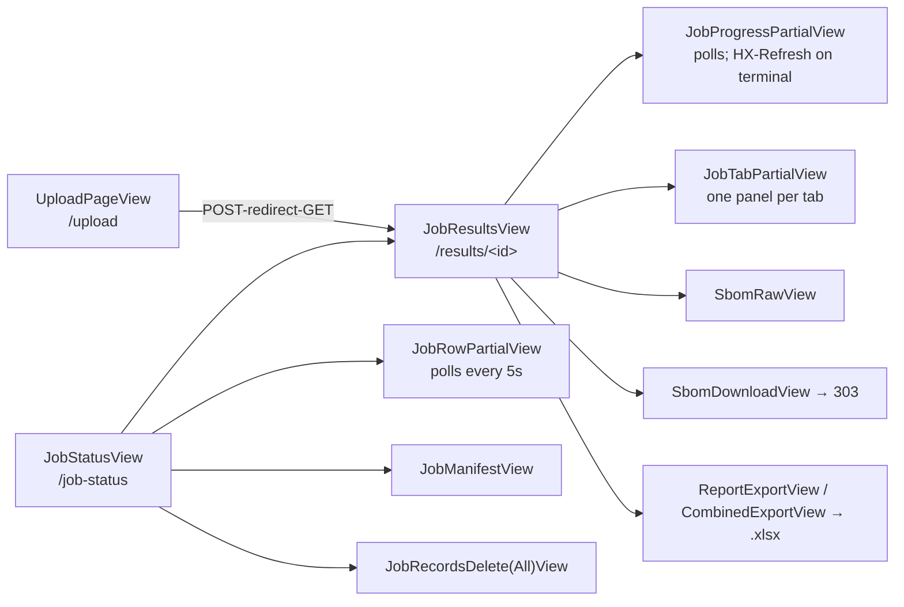

- **`UploadPageView`** reproduces none of the submission invariants — it calls
  `submit_job`, which owns all of them. `ConcurrencyLimitError` becomes a **form-level**
  error (nothing the user typed is wrong); format and parse errors attach to the **file**
  field. Success is a redirect (AC #4: a refresh must not enqueue a second job), and the
  job is filed against the **chosen** org, not `self.org`.
- **`JobStatusView`** is a `SingleTableMixin` + `FilterView` over `get_all_jobs()`.
  Sorting, filtering, and paging are all querystring-driven so a view is bookmarkable —
  the deliberate trade against the SPA's in-browser sorting. `_describe_scope()` builds a
  plain-English description of what "delete all" would cover, because a confirmation that
  misdescribes its blast radius is worse than none.
- **`JobRecordsDeleteAllView`** re-applies the page's filters from the **POST**ed hidden
  fields, so it deletes exactly what was on screen. Without that, Story 22.16's cross-org
  change would have quietly turned "every job in my org" into "every job in the
  deployment" behind the same button.
- **`_JobScopedView`** looks a job up with `get_any_job` — cross-org, because Job Status
  lists every org's jobs and a row must open. `OrgContextMixin` stays for `self.org`.
- **`JobTabPartialView`** injects `tab` back into `request.GET` before rendering:
  django-tables2 builds sort links by preserving the current query string, and the
  fragment URL carries none — so sorting inside a tab used to emit a bare `?sort=name`,
  navigating to the results page with no tab and landing on Overview (Story 22.25). It
  also returns the **whole tab panel**, strip included, so the highlighted tab and the
  visible body can never disagree (Story 22.21).
- **Tab context builders** (`sbom_tab_context`, `vulnerabilities_tab_context`,
  `licenses_tab_context`, `versions_tab_context`) are dispatched by one `tab_context()`
  function shared by the shell and the htmx partial, so a tab rendered cold from `?tab=`
  and the same tab fetched by a click cannot diverge. The vulnerabilities builder keeps
  **four** states apart — `failed`, `missing`, `clean`, `ok` — because a clean scan is a
  result, not an absence.
- **`JobManifestView`** renders the uploaded manifest into an escaped `<pre>` rather than
  serving it as a file: a manifest is whatever someone uploaded, and a raw response would
  let it choose how the browser treats it. Above `MANIFEST_INLINE_MAX_BYTES` (1 MB) it is
  described instead of shown.
- **`SbomRawView`** exists so a multi-megabyte document never rides along in the SBOM
  tab's payload; above `RAW_INLINE_MAX_BYTES` (2 MB) it points at the download instead.
- **Excel exports** are generated on demand and **never stored**, so AD-6's storage triad
  is untouched. A *failed* report is omitted from the workbook rather than emitted as an
  empty sheet, which would read as "we checked and found nothing".

---

## 7. `analysis/` — the three reports

### `models.py` — `AnalysisReport`

Deliberately **not** `OrgScopedModel`: isolation is transitive through its parent
`SBOMJob`, which is only ever reached via `SBOMJob.objects.for_org(org)`. One row per
`(job, report_type)` — unique-constrained, so a chord re-run upserts rather than
conflicts. Only the `artifact_key` and a small `summary` live in the database; the report
blob lives in object storage (AD-6). `failed` + `failure_reason` record a phase that ran
and errored.

### `reports.py` — the three-state read

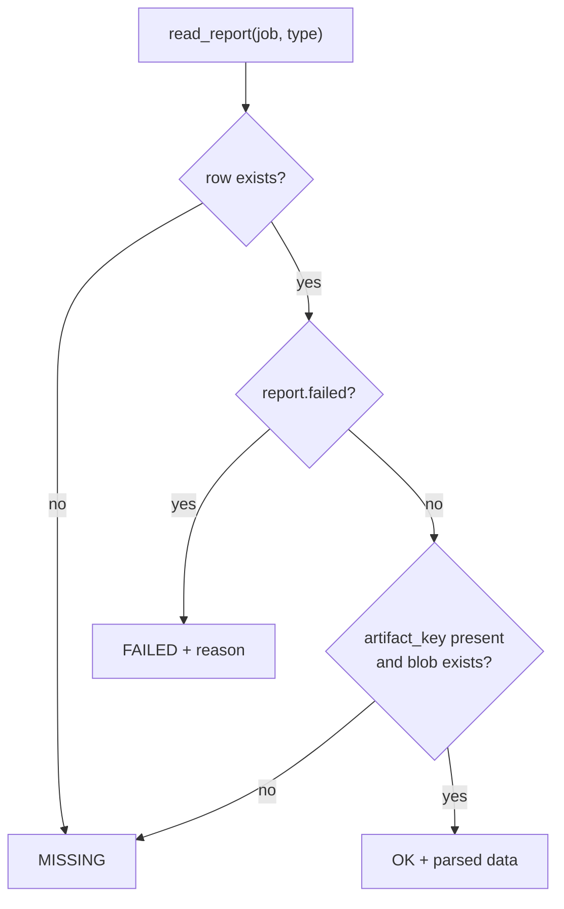

`failed` is checked **before** the artifact, because a failed phase has a reason worth
showing even though it also has no artifact — reporting it as merely "missing" would lose
that. `OK` may legitimately contain no findings; that is a clean result, not an empty one.

### `services/http.py` — external-API infrastructure

`CachedLimiterSession` combines `requests_cache.CacheMixin`,
`requests_ratelimiter.LimiterMixin`, and `requests.Session`, with a **default timeout
applied in `request()`**.

| Session | Cache TTL | Rate | Notes |
| --- | --- | --- | --- |
| `osv_session` | 24 h | 1/s | Vulnerability discovery + detail |
| `pypi_session` | 1 h | 5/s | License metadata and latest versions |
| `nvd_session` | 24 h | 1/s | CVSS/CWE enrichment |
| `eol_session` | 7 d | 2/s | endoflife.date; **caches 404s** (most packages are untracked) |
| `prefix_dev_session` | 24 h | 3/s | conda-forge latest; caches **POST** (GraphQL) |
| `parselmouth_session` | 24 h | 3/s | Per-package name disambiguation; caches 404s |

The cache is keyed by URL (package identity) only, so it is safely shared across orgs —
the data is public (FR-5.5). Backend is `memory` locally/in tests and `redis` in
production, so analysis workers share it.

!!! danger "The timeout is not decoration"
    `requests` has no default timeout, so an accepted-but-unanswered connection blocks the
    calling thread forever. That stalled the Windows worker three times on CI, at
    `scan_vulnerabilities`, with no further output. The **tuple** form matters: a bare
    number bounds only the read, and a black-holed SYN needs the connect bound. It lives on
    the session rather than at each call site because the call sites are what went wrong.

`external_retry` wraps transient `RequestException`s in tenacity: 3 attempts, exponential
backoff, reraise.

### `services/vulnerability.py` — Phase 4

Batches packages (1000 per request) to the **OSV** `querybatch` API, fetches per-vuln
detail (memoised per id within a run), and enriches from **NVD** when OSV lacks a CWE,
severity, or numeric score. NVD enrichment is strictly best-effort: any failure returns
`{}` and the entry is emitted without it.

`_normalize_severity` maps OSV/NVD labels to Critical/High/Medium/Low, falling back to
CVSS thresholds (≥9.0, ≥7.0, ≥4.0), else `Unknown`. Only **vulnerable** packages are
listed; the summary carries the vulnerable-package count and a severity breakdown.

### `services/license.py` — Phase 5

The resolved package set is not installed in this environment, so the license source is
the **PyPI JSON API**, not `pip-licenses`. Precedence per package:

1. PEP 639 `license_expression`
2. A recognised Trove classifier (a curated `_CLASSIFIER_SPDX` map)
3. A short free-text `license` value (≤40 chars, single line) — longer text is not
   classifiable

`_classify_license` then places the id into one of four tiers, ordered by **descending
attention required**: `Strong Copyleft` → `Weak Copyleft` → `Unknown` → `Permissive`.
AGPL/GPL are strong; LGPL/MPL are weak; a curated `_PERMISSIVE_SPDX` set is permissive;
anything unrecognised is `Unknown` rather than assumed safe.

`build_license_map()` exposes the same normalisation to **Phase 3**, so the SBOM document
and the Licenses tab derive from one source and cannot diverge — and because it shares the
cached PyPI session, Phase 3 warms the cache Phase 5 later reads.

### `services/versions.py` — Phase 7

Classifies each package as `current` / `behind-1` / `behind-2+` / `unknown` against the
PyPI latest, with LTS awareness. **LTS precedence (Story 8.7):**

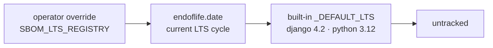

"Current LTS" means the highest LTS cycle whose `eol` is still in the future; if every LTS
cycle is past EOL it degrades to the highest cycle rather than returning nothing. Being on
the tracked LTS series counts as `current`.

Each package also records its latest **conda-forge** version (resolved through
`parselmouth` then queried from prefix.dev's GraphQL API, with variables — injection-safe)
and a `latest_mismatch` flag when it diverges from the PyPI latest. Currency itself stays
PyPI-based.

### `services/parselmouth.py` — conda ↔ PyPI name mapping

conda-forge names often differ from PyPI names (conda `pytorch` ↔ PyPI `torch`).
parselmouth's `compressed_mapping.json` maps conda → PyPI; this module loads it from a
**bundled gzipped snapshot** (`services/data/compressed_mapping.json.gz`, so lookups work
on a fresh stack), overlaid by a **locally-stored** copy refreshed weekly by a Beat task,
and inverts it for PyPI → conda.

About 1.5% of PyPI names have more than one conda candidate, which the bulk map cannot
disambiguate. Resolution precedence in `pypi_to_conda`:

1. A curated override (`build` → `python-build`; conda-forge's own `build` is an unrelated
   project)
2. parselmouth's authoritative per-package file, for ambiguous names only — take the conda
   name of the latest release
3. The inverted bulk map
4. The same name

`refresh_mapping()` fetches, stores, and invalidates the module-level caches; errors
propagate to the calling task, and lookups keep using the previous copy until a refresh
succeeds.

### `services/reports.py` — the chord envelope

`make_envelope(report_type, *, artifact_key, summary, failed, failure_reason)` builds the
standard shape every analysis task returns; `write_report(job, envelope)` upserts an
`AnalysisReport` keyed on `(job, report_type)`.

### `tables.py`, `filters.py`, `excel.py`, `views.py`, `urls.py`

- **`tables.py`** — `vulnerability_rows` flattens the report to one row per finding
  (merging OSV id with aliases, de-duplicated and order-preserving); `version_rows` adds
  a sort rank and registry URL. Both tables sort by a **numeric rank**, never by the
  label: alphabetical severity puts "Critical" after "High" and buries the worst findings,
  and alphabetical currency reads "behind-1, behind-2+, current, unknown" — which *looks*
  sorted and puts the most outdated packages in the middle. `registry_url` returns `None`
  for an unknown ecosystem so the caller renders plain text rather than a link that 404s.
- **`filters.py`** — `filter_by_severity` is a plain function, not a `FilterSet`, because
  the rows come from a JSON artifact rather than the database. An unrecognised severity
  yields **no** rows, so a stale link cannot misrepresent a filtered view as complete.
- **`excel.py`** — server-side `.xlsx` generation via openpyxl, ported one-for-one from
  the retired browser-side exceljs code (this was the last piece that made Node a runtime
  requirement). `SheetSpec` + `build_workbook`; two styled-cell kinds (`HyperlinkCell`,
  `RedTextCell`); `safe_sheet_name` enforces Excel's illegal-character and 31-char rules,
  because openpyxl raises and a report title containing a slash would turn a download into
  a 500. **Column orders are not to be tidied** — Story 8.23 deliberately places PyPI
  Latest immediately before conda-forge Latest.
- **`views.py` / `urls.py`** — three JSON endpoints at
  `/api/v1/sbom/result/<task_id>/reports/{vulnerabilities,licenses,versions}/`, sharing a
  `_JsonReportView` base. A missing report is `not_ready`; a failed one is `report_failed`
  *with its reason*; both are 404, so a cross-org job is indistinguishable from an
  unknown one.

---

## 8. `tasks/` — the Celery pipeline

### `__init__.py` — task registration, not a public API

`config/celery_app.py` calls `autodiscover_tasks(["inventory"])`, which imports this
*package* — so whatever this module imports is what Celery registers, and whatever it does
not import is invisible to Beat and to every worker.

That has already cost the project once: `maintenance` was missing here, so both
`beat_schedule` entries named tasks that were never registered (Story 22.2). `analysis` is
listed explicitly for the same reason, even though `sbom_pipeline` happens to import it.
`tests/unit/test_beat_schedule_registry.py` fails if a scheduled task is unreachable from
here.

### `sbom_pipeline.py` — the eight-phase canvas

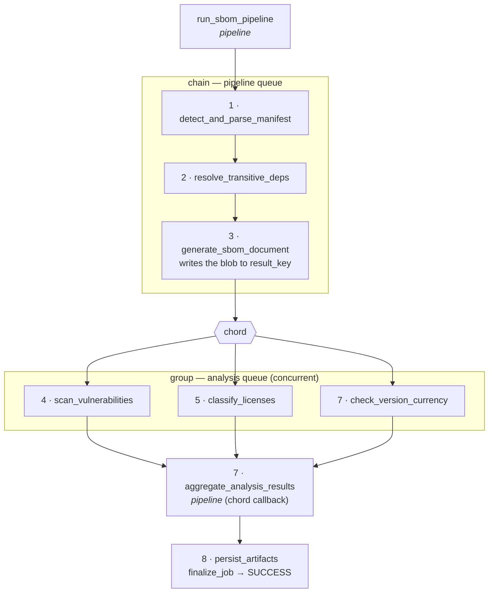

Two queues (AD-4): `pipeline` for phases 1–3, aggregate, and 8; `analysis` for the three
report builders. `task_id` threads the whole chain — **only keys and counts flow through
the result backend, never blobs** (AD-6). Every task is `@shared_task`, with no Celery app
import (AD-10).

**`_phase_guard(task_id, key)`** owns each task's lifecycle so a phase cannot forget one
half of it:

| Outcome | `JobTask` | `SBOMJob` |
| --- | --- | --- |
| Success | `COMPLETE` | progress recomputed |
| `SoftTimeLimitExceeded` | `ERROR` (`soft_timeout`) | `FAILED`, reason `soft_timeout` — no partial SBOM (FR-4.6) |
| Any other exception | `ERROR` (`pipeline_error`) | `FAILED`, preserving a specific reason a phase already set, else `pipeline_error` |

`_fail_if_unfinished` is the safety net: a job can never be left stuck at PROGRESS because
a phase raised.

**Per-phase notes.** Phase 2 maps a `ResolutionError` to the specific reason
`resolution_failed`, so the UI explains a bad manifest instead of spinning. Phase 3 is the
FR-4.5 **hard-fail boundary** — it resolves the license map (I/O) and hands it to the pure
serializer, writes the blob to
`sbom-results/{org_id}/{task_id}/sbom.{ext}`, and records the key and package count
(*not* a status write; Phase 8 finalizes). Phase 8 guards the invariant that Phase 3
always recorded a key, failing with `missing_artifact` if not.

### `analysis.py` — the three report tasks

All three go through one `_run_phase` helper. Its contract: **an analysis failure never
raises.** It yields a `failed` envelope instead, so the chord and the job still complete
with the SBOM and whatever reports succeeded (FR-4.5). Each task also writes its own
`JobTask` row — reporting only to Celery's result backend left the display showing
"Generate SBOM document" for the whole analysis fan-out, the longest part of a real run.

The first line of `_run_phase` is a `logger.info` placed **before** `update_state` and the
job load, both of which touch the database: without it, a phase that blocks in either
produces no output at all and the worker log stops at Celery's own "Task … received" —
which is where three Windows CI failures left the investigation with nothing to go on.

Each report is written to `sbom-results/{org_id}/{task_id}/{vuln,licenses,versions}.json`.

### `maintenance.py` — scheduled work

- `refresh_parselmouth_mapping` (queue `analysis`) — weekly via Beat.
- `purge_expired_artifacts` (queue `pipeline`) — **registered but not scheduled.** It ran
  nightly until Story 22.6; deleting artifacts is now a deliberate act taken after
  reviewing what would go. `artifacts_expire_at` is still stamped, so expiry is still
  *tracked*; nothing is purged until someone runs the management command.

---

## 9. `management/commands/`

Django looks for commands **only** at the app root's `management/commands/` — one placed
inside a sub-package is silently never found, a trap this project has already paid for.

| Command | What it does |
| --- | --- |
| `seed_orgs` | Idempotently creates the deployment's organizations from `INVENTORY_ORGS_FILE` (default `orgs.yml`). **Matches by slug, never by name** — the slug is the identity that `INVENTORY_DEFAULT_ORG_SLUG`, the switcher, and API keys reference. A name that differs from the file is *reported*, not silently rewritten. Refuses the reserved `admin` slug. `--dry-run` supported; creation is one transaction, because a half-seeded tenant list is exactly the state to avoid |
| `seed_superuser` | Creates the superuser from `DJANGO_SUPERUSER_EMAIL` / `DJANGO_SUPERUSER_PASSWORD` if unset-safe and not already present. The `create_superuser` hook then seeds them into the ADMIN org. Never logs the password |
| `bootstrap_admin_org` | Ensures the ADMIN org exists and back-fills every existing superuser as a global admin — for accounts created before the hook existed |
| `purge_expired_artifacts` | The on-request retention sweep. Lists what it would remove (in both modes, so a real run's output is a record of what was deleted), then purges unless `--dry-run`. Job records and metadata are always kept (FR-8.1) |

`expired_jobs_holding_artifacts()` is exposed as a function so `--dry-run` and the tests
report on **exactly** the set the purge will delete, rather than a second query that could
drift from it.

---

## 10. `migrations/`

| Migration | Contents |
| --- | --- |
| `0001_initial` | `Org`, `OrgMembership`, `OrgApiKey`, `ManifestUpload`, `SBOMJob`, `AnalysisReport` — the whole collapsed app in one schema step (Story 21.2) |
| `0002_seed_admin_org` | Data: the distinguished ADMIN org. Ported unchanged from the dissolved `users.0004`, with only the `get_model` label edited |
| `0003_seed_default_org` | Data: the org anonymous callers act as (`enterprise-wells-fargo-technology`). `is_admin_org=False` is load-bearing — pointing the anonymous default at the ADMIN org would resurrect the bug Stories 2.12/2.18 fixed |
| `0004_jobtask` | The per-task progress table (Story 22.20) |

Both data migrations are idempotent `get_or_create` and reversible, kept separate from
`0001` so each step stays legible and independently reversible.

---

## 11. `templates/inventory/`

App-owned templates, found through `APP_DIRS` rather than the host project's `DIRS` —
which is what would let them travel to another host later.

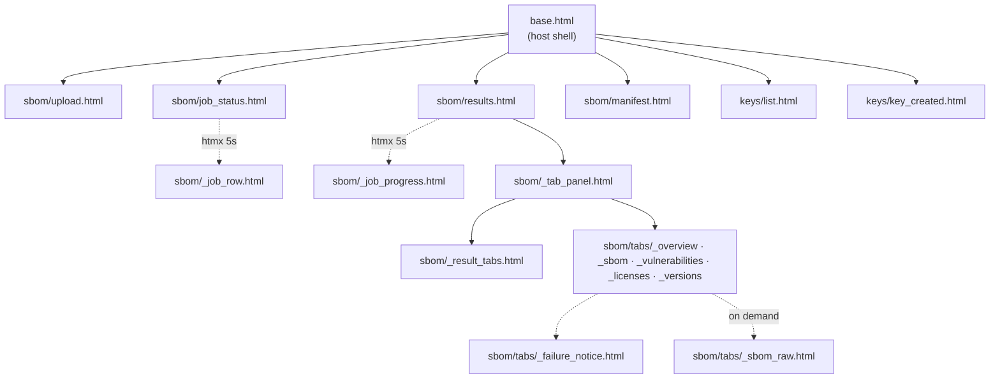

Points worth knowing before editing one:

- **`_job_row.html`** supplies only the `<tr>` wrapper and its htmx attributes; the cells
  come from the same `JobTable` as the full table, so the markup is produced in one place.
- **`_job_progress.html`** renders a **list** of tasks, not a single "current step" line —
  two analysis tasks really can be running at once. `data-task-key` keeps each task's
  animated-dot counter separate; the counter itself lives in `task-dots.js`, loaded from
  `base.html`, because anything kept in this fragment restarts on every 5-second swap.
- **`_tab_panel.html`** is the swap target, strip *and* body together. Swapping only the
  body left "Overview" highlighted while another tab's content showed.
- **`_licenses.html`** renders tiers **in the order the report supplies them** — the
  backend classifier owns the descending-attention order, and hardcoding it here would
  make a future reclassification render wrongly with nothing to catch it. It uses native
  `<details>`/`<summary>` so per-tier toggling needs no JavaScript.
- **`_vulnerabilities.html`** branches on four states; collapsing any two is the defect
  this tab is most prone to.
- **`manifest.html`** passes content through `{{ }}` so Django escapes it — the reason
  this is a page rather than a file response.

!!! danger "Comment syntax"
    Use `…` for multi-line notes. Django's lexer has no
    DOTALL, so a multi-line `{# … #}` leaks into the HTML **and** compiles any tags
    inside it.

---

## 12. Cross-cutting invariants

The rules that hold across the whole app. Each is enforced in exactly one place.

| Ref | Invariant | Where it lives |
| --- | --- | --- |
| AD-1 | One-way dependency direction between subpackages | Import discipline; `sbom` never imports `analysis` |
| AD-2 | The org is the tenancy boundary | `OrgScopedModel.for_org()` — inside the query |
| AD-3 | Behaviour lives in `services.py`/`selectors.py`; views and tasks are thin | The file-role convention |
| AD-4 | Two Celery queues: `pipeline` and `analysis` | `@shared_task(queue=…)` + `celery_app.py` |
| AD-5 | Documents are read inline; that is distinct from downloading them | `read_inline_document` vs `presigned_artifact_url` |
| AD-6 | Only keys travel through the chain; blobs live in object storage | Phase 3 writes the blob; Phase 8 finalizes the record |
| AD-7 | Per-org concurrency gate | `at_concurrency_limit`, called once in `submit_job` |
| AD-8 | API keys are library-hashed, org-scoped, soft-revocable | `OrgApiKey` + `OrgApiKeyAuthentication` |
| AD-10 | Dispatch with `delay_on_commit`; tasks use `@shared_task` only | `submit_job` |
| AD-11 | Django never streams artifact bytes — it redirects to a presigned URL | `presigned_artifact_url` + the 303 views |
| AD-12 | `SBOMJob.status` is written only through `sbom/services.py` | `create_job`, `update_job_status`, `finalize_job` |
| AD-14 | direct/transitive by declared-set intersection on PEP 503 names | `parsers/_types.tag_relationships` |
| AD-15 | Page views call services, never their own HTTP API | `pages.py` |
| FR-4.5 | An analysis failure degrades the report, not the job | `tasks/analysis._run_phase` |
| FR-8.1 | Artifact purging keeps job records and metadata | `delete_job_artifacts` |

---

## 13. The host side

Two packages outside `inventory` complete the runtime. They are the *host*: `inventory`
depends on neither of them by name.

### `src/config/` — Django project configuration

| File | Role |
| --- | --- |
| `__init__.py` | Imports the Celery app so `@shared_task` works at Django startup |
| `celery_app.py` | The Celery application, two queues, and the Beat schedule. Calls `autodiscover_tasks(["inventory"])` explicitly, because the tasks live in a dedicated `inventory.tasks` package rather than a per-app `tasks.py` |
| `urls.py` | Root urlconf: landing page, health, `/admin/`, the app's page urlconf at the root, the four API urlconfs under `/api/v1/`, and the schema/docs routes behind `API_DOCS_ENABLED`. `media_urlpatterns()` serves `MEDIA_ROOT` **only** under `DEBUG` — a function rather than an inline `if` so the rule is testable |
| `settings/base.py` | All shared settings, read from the environment via django-environ. `BASE_DIR` is the **repository root** (four `parent` hops); SQLite gets `transaction_mode = "IMMEDIATE"` + WAL, which is what stops the three-process `pixi run dev` stack from producing "database is locked" |
| `settings/local.py` | Containerless dev: SQLite, filesystem storage, console logs, and a **filesystem** Celery broker under `.celery/` so no Redis is needed. `data_folder_in` and `data_folder_out` must be the same directory |
| `settings/test.py` | Inherits `local` and forces `CELERY_TASK_ALWAYS_EAGER` so the unit suite runs fully offline |
| `settings/production.py` | `DEBUG=False`, HSTS/secure cookies, Redis-backed requests cache, and S3/MinIO storage via `inventory.common.storage.PublicEndpointS3Storage` |
| `wsgi.py` / `asgi.py` | Default to `config.settings.production` — the container/prod path only |

### `src/django_service/` — the host project

| File | Role |
| --- | --- |
| `users/models.py` | The concrete email-login `User`. **Nothing under `inventory` may import it.** Its `create_superuser` calls `inventory.users.services.grant_global_admin` — the host depending on the app, which is the allowed direction |
| `users/apps.py` | `label = "users"`, explicitly — the label the dissolved app freed, which keeps `AUTH_USER_MODEL = "users.User"` unchanged and avoids a swappable-model migration |
| `context_processors.py` | Product name (two forms), version, repo/docs URLs, and the acting org — all lazily via `SimpleLazyObject`, since this runs for **every** template render including the API docs pages. The role flags are constant `True` since Story 21.24 and are **kept rather than deleted**, because they mark where Epics 17–18 put authorization back |
| `icons.py` + `templatetags/ui_icons.py` | Semantic icon names (`nav.home`, `tab.vulnerabilities`) → sprite symbol ids. A missing name raises rather than rendering an invisible empty box |
| `views.py` | The landing page and the shell preview |
| `templates/` | `base.html`, `landing.html`, nav partials, and the 403/404/500 pages |
| `static/` | Vendored Bootstrap, htmx, the icon sprite, `theme.js`, and `task-dots.js` — no CDN |

---

## See also

- [Architecture](architecture.md) — the layered design and its invariants
- [SBOM Pipeline](pipeline.md) — the eight phases in narrative form
- [Data Model](data-model.md) — the models and their relationships
- [Code Reference](code-reference.md) — API docs generated from the docstrings
- [Testing](testing.md) — how the unit/integration split mirrors this tree
